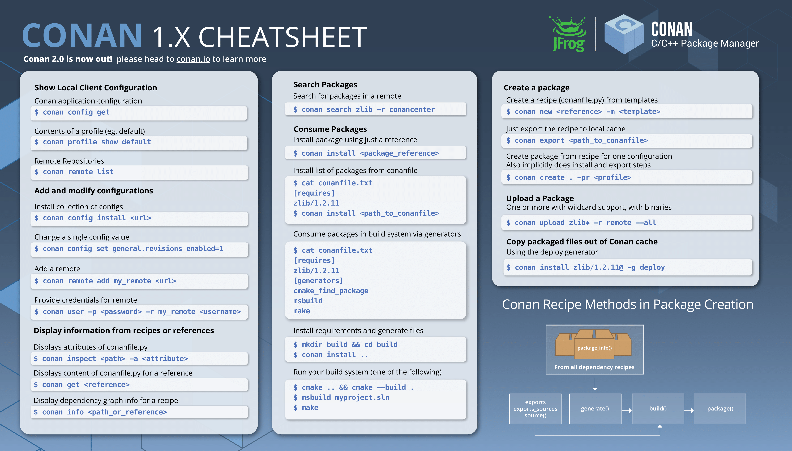

Cheatsheet
============================================

Single-Page Graphical Format
----------------------------

JFrog has created the following visual cheatsheet for basic Conan commands and
concepts which users can print out and use as a handy reference. It is available
as both a PDF and PNG.

  :download:`PDF Format <images/cheatsheet/conan-cheatsheet.pdf>`

  :download:`PNG Format <images/cheatsheet/conan-cheatsheet.png>`
  

.. cheatsheet:

Cheatsheet
==========

Consuming Packages
------------------

'conan install' installs the requirements specified in a recipe (`conanfile.py` or `conanfile.txt`).

conanfile.txt

.. code-block:: text

    [requires]
    booost/1.72.0
    poco/1.9.4

    [generators]
    cmake

    [options]
    boost:shared=False
    poco:shared=False

Release build:

.. code-block:: bash

    $ mkdir build
    $ cd    build
    $ conan install ..
    $ cmake .. -DCMAKE_BUILD_TYPE=Release

Debug build:

.. code-block:: bash

    $ conan install .. -s build_type=Debug
    $ cmake .. -DCMAKE_BUILD_TYPE=Debug

    conan search
    conan search zlib/1.2.11@ --table=file.html -r=conan-center

Visualizing Dependencies
++++++++++++++++++++++++

.. code-block:: bash

    # In a directory with conanfile.txt or conanfile.py, create image of dependencies:
    $ conan info . --graph=file.html

Searching Packages
++++++++++++++++++

'conan search' searches package recipes and binaries in the local cache or a remote.

.. code-block:: bash

    $ conan search              # lists names of packages
    $ conan search zlib/1.2.11@ # shows recipe's Package_ID, [options] and [settings]
    $ conan search zlib/1.2.11@ --table=file.html -r=conan-center

Inspecting Packages
+++++++++++++++++++

'conan get'

.. code-block:: bash

    $ conan get     zlib/1.2.11@    # prints out the Python recipe of the package
    $ conan inspect zlib/1.2.11@    # prints details of the package

Creating Packages
-----------------

.. code-block:: bash

    # in a directory that has a conanfile.py representing a package:
    $ conan create . user/testing                     # Creates a release package
    $ conan create . user/testing -s build_type=Debug # Creates a debug package
    $ conan search hello/0.1@user/testing

Notes:

- ConanCenter does not use user/channel
- Custom packages you create should use user/channel

Options
+++++++

.. code-block:: bash

    $ conan create . user/testing -s build_type=Debug -o hello:shared=True

Profiles
++++++++

.. code-block:: bash

    $ conan profile list
    $ conan profile show default
    $ conan install . -pr=windows -pr=vs2017 # composable, last -pr wins

Cross-Compiling
+++++++++++++++

File rpi_armv7:

.. code-block:: text

    [settings]
    os=Linux
    compiler=gcc
    compiler.version=6
    compiler.libcxx=libstdc++11
    build_type=Release
    arch=armv7
    os_build=Linus
    arch_build=x86_64

    [env]
    CC=arm-linux-gnueabihf-gcc
    CXX=arm-linux-gnueabihf-g++

.. code-block:: bash

    $ conan create . user/testing -pr=rpi_armv7 # Use a different profile
    $ conan search hello/0.1@user/testing

Publishing Packages
-------------------

Uploading Packages to Artifactory
+++++++++++++++++++++++++++++++++

.. code-block:: bash

    $ conan remote add artifactory http://35.223.57.164:8081/artifactory/api/conan/myconanrepo
    $ conan remote list
    $ conan upload "hello*" -r artifactory --all
    $ conan search "*" -r=artifactory
    $ conan search hello/0.1@user/testing -r=artifactory
    $ conan upload "*" -r artifactory --all --confirm

Other Information
-----------------

Local Cache
+++++++++++

.. code-block:: text

    ~/.conan/
