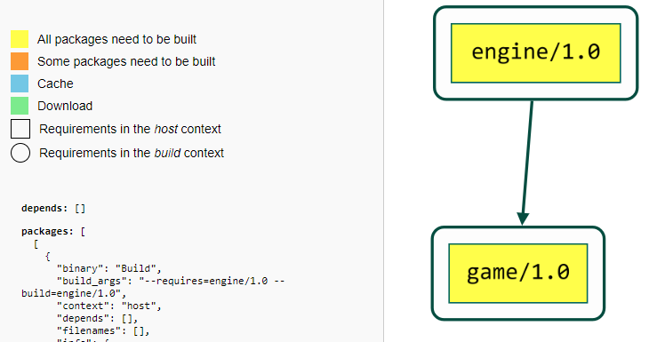

Products pipeline: decentralized build
======================================

The previous section used ``--build=missing`` to build all the necessary packages in the same CI machine.
This is not always desired, or even possible, and in many situations it is preferable to do a distributed build, to achieve faster builds and better use the CI resources. The most natural distribution of the build load is to build different packages in different machines. Let's see how this is possible with the ``conan graph build-order`` command.

Let's start as usual making sure we have a clean environment with the right repositories defined:

.. code-block:: bash

    $ conan remove "*" -c  # Make sure no packages from last run
    $ conan remote remove "*"  # Make sure no other remotes defined
    # Add products repo, you might need to adjust this URL
    # NOTE: The products repo is added first, it will have higher priority.
    $ conan remote add products http://localhost:8081/artifactory/api/conan/products
    # Add develop repo, you might need to adjust this URL
    $ conan remote add develop http://localhost:8081/artifactory/api/conan/develop

We will obviate by now the ``mapviewer/1.0`` and focus this section in the ``game/1.0`` product.
The first step is to compute the "build-order", that is, the list of packages that need to be build, and in what order.
This is done with the following ``conan graph build-order`` command:

.. code-block:: bash

    $ conan graph build-order --requires=game/1.0 --build=missing --order-by=recipe --reduce --format=json > game_build_order.json

Note a few important points:

- It is necessary to use the ``--build=missing``, in exactly the same way than in the previous section. Failing to provide the intended ``--build`` policy and argument will result in incomplete or erroneous build-orders.
- The ``--reduce`` eliminates all elements in the result that doesn't have the ``binary: Build`` policy. This means that the resulting "build-order" cannot be merged with other build order files for aggregating them into a single one, which is important when there are multiple configurations and products.
- The ``--order-by`` argument allows to define different orders, by "recipe" or by "configuration". In this case, we are using the ``--order-by=recipe`` which is intended to parallelize builds per recipe, that means, that all possible different binaries for a given package like ``engine/1.0`` should be built first before any consumer of ``engine/1.0`` can be built.

The resulting ``game_build_order.json`` looks like:

.. code-block:: json
  :caption: game_build_order.json

    {
        "order_by": "recipe",
        "reduced": true,
        "order": [
            [
                {
                    "ref": "engine/1.0#fba6659c9dd04a4bbdc7a375f22143cb",
                    "packages": [
                        [
                            {
                                "package_id": "de738ff5d09f0359b81da17c58256c619814a765",
                                "binary": "Build",
                                "build_args": "--requires=engine/1.0 --build=engine/1.0",
                                
                            }
                        ]
                    ]
                }
            ],
            [
                {
                    "ref": "game/1.0#1715574045610faa2705017c71d0000e",
                    "depends": [
                        "engine/1.0#fba6659c9dd04a4bbdc7a375f22143cb"
                    ],
                    "packages": [
                        [
                            {
                                "package_id": "bac7cd2fe1592075ddc715563984bbe000059d4c",
                                "binary": "Build",
                                "build_args": "--requires=game/1.0 --build=game/1.0",
                            }
                        ]
                    ]
                }
            ]
        ]
    }

For convenience, in the same way that ``conan graph info ... --format=html > graph.html`` can generate a file with an HTML interactive dependency graph, the ``conan graph build-order ... --format=html > build_order.html`` can generate an HTML visual representation of the above json file:

Note that this
- not upload yet
- html
