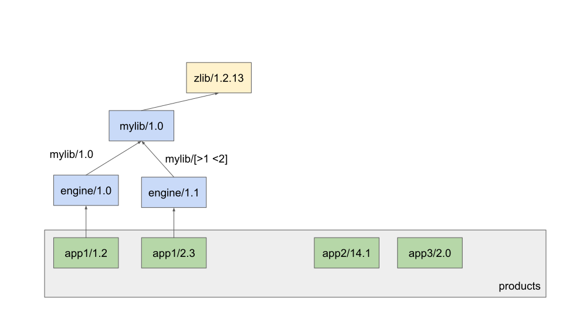
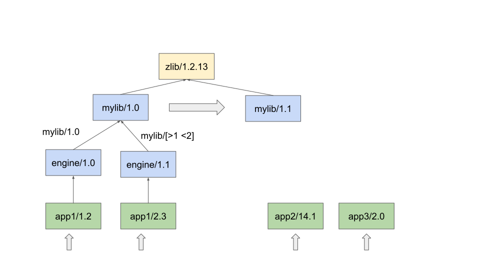
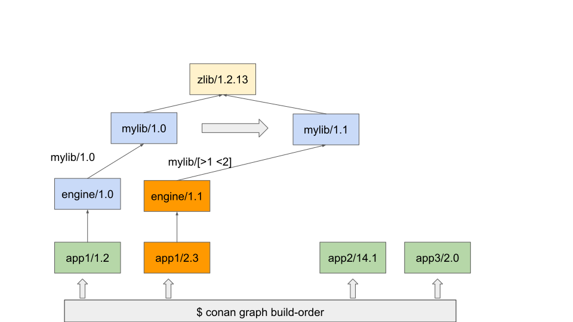

.. _devops_product_pipeline:

The Product Pipeline: Updating consumers of libraries after changes
===================================================================

When using version ranges and a new version of a package is published, the need to rebuild every recipe that depends on the new package might arise.
As Conan is fully decentralized, solving the problem of which recipes depend on the newly built package can quickly become
intractable as the depth of the graph and number of remotes and built configurations rises.

Conan thus recommends to solve this by flipping the problem on its head. Instead of asking which dependencies would need to be rebuilt,
a better approach is, for every product (ie, a specific recipe you distribute or are in charge of) you care about,
to calculate the build order.

The state of your packages might look something like this, where you actively maintain both `app1/1.X` and `app1/2.X` major versions,
alongside other products, such as `app2/14.2`, ... `appn/x.y` etc.

After a new 1.1 release of mylib, we would like to re-compute the graph of our products and generate those with missing binaries.

For this the suggested approach is, for every one of our "products", we run ``conan graph build-order --requires=app1/1.2 -f=json``.

This will output a json list of levels as described in the :ref:`conan graph build-order<reference_graph_build_order>` documentation.

For every level, packages that appear with ``binary: "Missing"`` should now be rebuilt, and it can be done so concurrently within each level.

.. note::

   You can also run :ref:`conan graph build-order-merge<reference_graph_build_order_merge>` to merge every build order into one,
   and process all your products at once, which might avoid unnecessary rebuilds.
