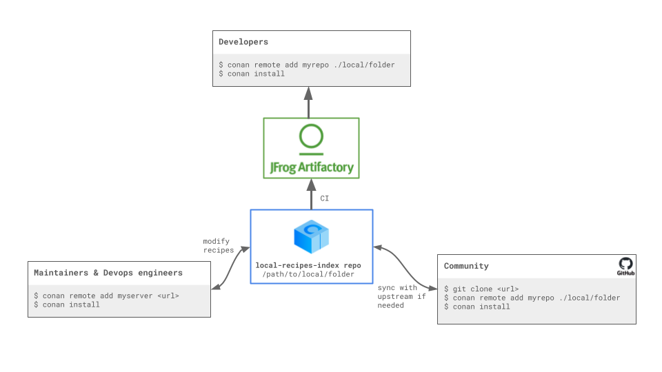

.. _devops_local_recipes_index:

Local Recipes Index Repository
==============================

The **Local Recipes Index** is an **experimental** repository type introduced in Conan to enhance
flexibility in managing C/C++ package recipes. This repository type allows users to
use a local directory as a Conan remote, where the directory structure mirrors that of
the `conan-center-index` GitHub repository.

This setup is particularly useful for:

- Building binaries from a private `conan-center-index` fork.

- Sharing your own recipes for certain libraries or tools that, due to licensing
  restrictions or proprietary nature, are not suitable for ConanCenter. Check how you can
  use it for this purpose in the dedicated section of the documentation
  :ref:`setup_local_recipes_index`.

Building Binaries from a private `conan-center-index` fork
----------------------------------------------------------

As we already introduced in the :ref:`previous section of the Conan DevOps Guide <devops>`
some organizations, particularly large enterprises, prefer not to use binaries downloaded
from the internet. Instead, they build their own binaries in-house using the
`conan-center-index` recipes. These organizations often need to customize these recipes to
meet unique requirements that are not applicable to the broader community, making such
contributions unsuitable for the upstream repository. 

The `local-recipes-index` allows users to maintain a local folder with the same structure
as the `conan-center-index` GitHub repository, using it as a source for package recipes.
This new type of repository is recipes-only, necessitating the construction of package
binaries from source on each machine where the package is used. For sharing binaries
across teams, we continue to recommend :ref:`using a Conan remote server like Artifactory
<artifactory_ce_cpp>` for production purposes.

The `local-recipes-index` repository allows you to easily build binaries from a fork of
`conan-center-index`, and then hosting them on a Conan remote repository like Artifactory.
The main difference with the process explained in the :ref:`previous section <devops>` is
the ability to immediately test multiple local changes without the need to export each
time a recipe is modified.

Note that in this case, mixing binaries from ConanCenter with locally built binaries is
not recommended for several reasons:

- Binary compatibility: There may be small differences in setup between the ConanCenter CI
  and the user's CI. Maintaining a consistent setup for all binaries can mitigate some
  issues.

- Full control over builds: Building all binaries yourself ensures you have complete
  control over the compilation environment and dependency versions.

Instead, it's recommended to build all your direct and transitive dependencies from the fork.
To begin, remove the upstream ConanCenter as it will not be used, everything will come
from our own fork:

.. code-block:: bash

    $ conan remote remove conancenter

Then we will clone our fork (in this case, we are cloning directly the upstream for demo
purposes, but you would be cloning your fork instead):

.. code-block:: bash

    $ git clone https://github.com/conan-io/conan-center-index

Add this as our `mycenter` remote:

.. code-block:: bash

    # Add the mycenter remote pointing to the local folder
    $ conan remote add mycenter ./conan-center-index

And that’s all! Now you're set to list and use packages from your `conan-center-index` local folder:

.. code-block:: bash

    $ conan list "zlib/*" -r=mycenter
    mycenter
      zlib
        zlib/1.2.11
        zlib/1.2.12
        zlib/1.2.13
        zlib/1.3
        zlib/1.3.1

We can also install packages from this repo, for example we can do:

.. code-block:: bash

    $ conan install --requires=zlib/1.3
    ...
    ======== Computing dependency graph ========
    zlib/1.3: Not found in local cache, looking in remotes...
    zlib/1.3: Checking remote: mycenter
    zlib/1.3: Downloaded recipe revision 5c0f3a1a222eebb6bff34980bcd3e024
    Graph root
        cli
    Requirements
        zlib/1.3#5c0f3a1a222eebb6bff34980bcd3e024 - Downloaded (mycenter)

    ======== Computing necessary packages ========
    Requirements
        zlib/1.3#5c0f3a1a222eebb6bff34980bcd3e024:72c852c5f0ae27ca0b1741e5fd7c8b8be91a590a - Missing
    ERROR: Missing binary: zlib/1.3:72c852c5f0ae27ca0b1741e5fd7c8b8be91a590a

As we can see, Conan managed to get the recipe for ``zlib/1.3`` from ``mycenter``, but
then it failed because there is no binary. This is expected, **the repository only contains
the recipes, but not the binaries**. We can build the binary from source with
``--build=missing`` argument:

.. code-block:: bash

    $ conan install --requires=zlib/1.3 --build=missing
    ...
    zlib/1.3: package(): Packaged 2 '.h' files: zconf.h, zlib.h
    zlib/1.3: package(): Packaged 1 file: LICENSE
    zlib/1.3: package(): Packaged 1 '.a' file: libz.a
    zlib/1.3: Created package revision 0466b3475bcac5c2ce37bb5deda835c3
    zlib/1.3: Package '72c852c5f0ae27ca0b1741e5fd7c8b8be91a590a' created
    zlib/1.3: Full package reference: zlib/1.3#5c0f3a1a222eebb6bff34980bcd3e024:72c852c5f0ae27ca0b1741e5fd7c8b8be91a590a#0466b3475bcac5c2ce37bb5deda835c3
    zlib/1.3: Package folder /home/conan/.conan2/p/b/zlib1ed9fe13537a2/p
    WARN: deprecated: Usage of deprecated Conan 1.X features that will be removed in Conan 2.X:
    WARN: deprecated:     'cpp_info.names' used in: zlib/1.3

    ======== Finalizing install (deploy, generators) ========
    cli: Generating aggregated env files
    cli: Generated aggregated env files: ['conanbuild.sh', 'conanrun.sh']
    Install finished successfully

We can see now the binary package in our local cache:

.. code-block:: bash

    $ conan list "zlib:*"
    Local Cache
      zlib
        zlib/1.3
        revisions
          5c0f3a1a222eebb6bff34980bcd3e024 (2024-04-10 11:50:34 UTC)
          packages
            72c852c5f0ae27ca0b1741e5fd7c8b8be91a590a
            info
              settings
                arch: x86_64
                build_type: Release
                compiler: gcc
                compiler.version: 9
                os: Linux
              options
                fPIC: True
                shared: False

Finally, upload the binary package to our Artifactory repository to make it available for
our organization, users and CI jobs:

.. code-block:: bash

    $ conan remote add myartifactoryrepo <artifactory_url>
    $ conan upload zlib* -r=myartifactoryrepo -c

This way, consumers of the packages will not only enjoy the pre-compiled binaries and
avoid having to always re-build from source all dependencies, but that will also provide
stronger guarantees that the dependencies build and work correctly, that all dependencies
and transitive dependencies play well together, etc. Decoupling the binary creation
process from the binary consumption process is the way to achieve faster and more reliable
usage of dependencies.

Remember, in a production setting, the `conan upload` command should be executed by CI,
not developers, following the :ref:`Conan guidelines <guidelines>`. This approach ensures
that package consumers enjoy pre-compiled binaries and consistency across dependencies.

Modifying the local-recipes-index repository files
---------------------------------------------------

One of the advantages of this approach is that all the changes that we do in every single
recipe are automatically available for the Conan client. For example, changes to the
`recipes/zlib/config.yml` file are immediately recognized by the Conan client. If you
edit that file and remove all versions but the latest and then we `list` the recipes:

.. code-block:: bash

    $ conan list "zlib/*" -r=mycenter
    mycenter
      zlib
        zlib/1.3.1

When some of the recipes change, then note that the current Conan home already contains a
cached copy of the package, so it will not update it unless we explicitly use the
``--update``, as any other Conan remote.

So if we do a change in the ``zlib`` recipe in ``recipes/zlib/all/conanfile.py`` and
repeat:

.. code-block:: bash

    $ conan install --requires=zlib/1.3.1 -r=mycenter --update --build=missing

We will immediately have the new package binary locally built from source from the new
modified recipe in our Conan home.

Using local-recipes-index Repositories in Production
----------------------------------------------------

Several important points should be considered when using this new feature:

- It is designed for **third-party packages**, where recipes in one repository are creating
  packages with sources located elsewhere. To package your own code, the standard practice
  of adding `conanfile.py` recipes along with the source code and using the standard
  `conan create` flow is recommended.

- The `local-recipes-index` repositories point to **local folders in the filesystem**.
  While users may choose to sync that folder with a git repository or other version
  control mechanisms, Conan is agnostic to this, as it is only aware of the folder in the
  filesystem that points to the (current) state of the repository. Users may choose to run
  git commands directly to switch branches/commit/tags and Conan will automatically
  recognise the changes

- This approach operates at the source level and does not generate package binaries. For
  deployment for development and production environments, the use of a remote package
  server such as Artifactory is crucial. It's important to note that this feature is not a
  replacement for Conan's remote package servers, which play a vital role in hosting
  packages for regular use.

- Also, note that a server remote can retain a history of changes storing multiple recipe
  revisions. In contrast, a `local-recipes-index` remote can only represent a single
  snapshot at any given time. 

- ConanCenter does not use ``python-requires``, as this is a mechanism more intended for
  first-party packages. Using ``python-requires`` in a ``local-recipes-index`` repository
  is possible (and experimental) at this moment, but only if the ``python-requires`` are also in the same index repository.
  It is not intended or planned to support having these ``python-requires`` in other repositories
  or in the user Conan cache.

Furthermore, this feature does not support placing server URLs directly in recipes; remote
repositories must be explicitly added with `conan remote add`. Decoupling abstract package
requirements, such as "zlib/1.3.1", from their specific origins is crucial to resolving
dependencies correctly and leveraging Conan's graph capabilities, including version
conflict detection and resolution, version-ranges resolution, :ref:`opting into
pre-releases <resolve_prereleases_summary>`, :ref:`platform_requires
<reference_config_files_profiles_platform_requires>`, :ref:`replace_requires
<reference_config_files_profiles_replace_requires>`, etc. This separation also facilitates
the implementation of modern DevOps practices, such as package immutability, full
relocatability and package promotions.

.. seealso::

    - :ref:`Using Local-Recipes-Index repositories to share your libraries <setup_local_recipes_index>`
    - `Introducing the Local-Recipes-Index Post <https://blog.conan.io/2024/04/23/Introducing-local-recipes-index-remote.html>`_
