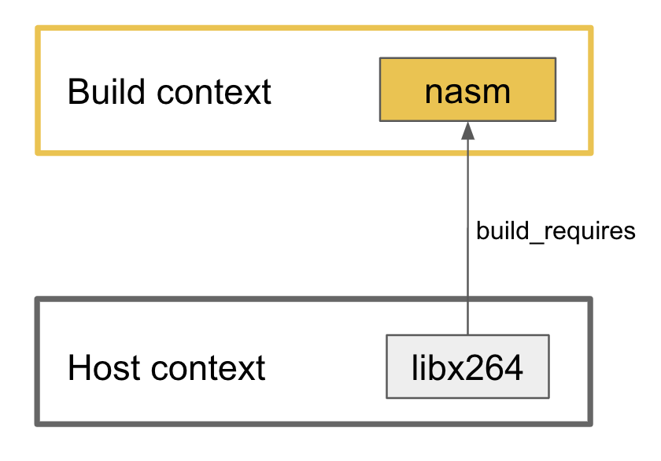

.. _create_installer_packages:

Creating conan packages to install dev tools
============================================

One of the most useful features of Conan is to package executables like compilers or build tools and
distribute them in a controlled way to the team of developers. This way Conan helps not only with the 
graph of dependencies of the application itself, but also with all the ecosystem needed to generate the
project, making it really easy to control everything involved in the deployed application.

Those tools need to run in the working machine (the ``build`` machine) regardless of the ``host`` platform
where the generated binaries will run. If those platforms are different, we are cross building software.

In this section we cope with the general scenario where a library requires other tools to compile that are
also packaged with Conan. Read this section first, and get more information specific to cross compiling in
the dedicated section of the docs: :ref:`cross_building`.

.. note::

    Conan v1.24 introduced a new feature to declare a full profile for the ``build`` and the ``host`` machine,
    it is the preferred way to deal with this scenario. Older versions should rely on the deprecated
    settings ``os_build`` and ``arch_build``. There is a small section below about those settings, for a full
    explanation read the docs matching your Conan client.

A Conan package for a tool is like any other package with an executable. Here it is a recipe for packaging
the ``nasm`` tool for building assembler:

.. code-block:: python

   import os
   from conans import ConanFile, tools
   from conans.errors import ConanInvalidConfiguration

   class NasmConan(ConanFile):
       name = "nasm"
       version = "2.13.02"
       license = "BSD-2-Clause"
       url = "https://github.com/conan-community/conan-nasm-installer"
       settings = "os", "arch"
       description="Nasm for windows. Useful as a build_require."

       def configure(self):
           if self.settings.os != "Windows":
               raise ConanInvalidConfiguration("Only windows supported for nasm")

       @property
       def nasm_folder_name(self):
           return "nasm-%s" % self.version

       def build(self):
           suffix = "win32" if self.settings.arch == "x86" else "win64"
           nasm_zip_name = "%s-%s.zip" % (self.nasm_folder_name, suffix)
           tools.download("http://www.nasm.us/pub/nasm/releasebuilds/"
                          "%s/%s/%s" % (self.version, suffix, nasm_zip_name), nasm_zip_name)
           self.output.info("Downloading nasm: "
                            "http://www.nasm.us/pub/nasm/releasebuilds"
                            "/%s/%s/%s" % (self.version, suffix, nasm_zip_name))
           tools.unzip(nasm_zip_name)
           os.unlink(nasm_zip_name)

       def package(self):
           self.copy("*", src=self.nasm_folder_name, dst="bin", keep_path=True)
           self.copy("license*", dst="", src=self.nasm_folder_name, keep_path=False, ignore_case=True)

       def package_info(self):
           self.env_info.PATH.append(os.path.join(self.package_folder, "bin"))

This recipe has nothing special: it doesn't declare the ``compiler`` and ``build_type`` settings because it is downloading
already available binaries, and it is declaring the information for their consumers as usual in the :ref:`method_package_info` method:

* The :ref:`cpp_info_attributes_reference` is not declared, so it will take its default values: the ``bindirs`` will point to the
  ``bin`` folder where the ``nasm.exe`` executable is packaged.
* In the :ref:`env_info_attributes_reference` attribute, it is adding the ``bin`` folder to the ``PATH`` environment variable.

This two simple declarations are enough to reuse this tool in the scenarios we are detailing below.

Using the tool packages in other recipes
----------------------------------------

These kind of tools are not usually part of the application graph itself, they are needed only to build the library, so
you should usually declare them as :ref:`build requirements <build_requires>`, in the recipe itself or in a profile.

For example, there are many recipes that can take advantage of the ``nasm`` package we've seen above, like 
`flac <https://conan.io/center/flac/1.3.3/?tab=recipe>`_ or `libx264 <https://conan.io/center/libx264/20191217/?tab=recipe>`_
that are already available in `ConanCenter <https://conan.io/center/>`_. Those recipes will take advantage of ``nasm`` 
being in the PATH to run some assembly optimizations.

.. code-block:: python
   :emphasize-lines: 4

    class LibX264Conan(ConanFile):
        name = "libx264"
        ...
        build_requires = "nasm/2.13.02"

        def build(self):
            ... # ``nasm.exe`` will be in the PATH here
        
        def package_info(self):
            self.cpp_info.libs = [...]

The consumer recipe needs only to declare the corresponding ``build_require`` and Conan will take care
of adding the required paths to the corresponding environment variables:

.. code-block:: bash

    conan create path/to/libx264 --profile:build=windows --profile:host=profile_host

Here we are telling Conan to create the package for the ``libx264`` for the ``host`` platform defined
in the profile ``profile_host`` file and to use the profile ``windows`` for all the build requirements
that are in the ``build`` context. In other words: in this example we are running a Windows machine 
and we need a version of ``nasm`` compatible with this machine, so we are providing a ``windows`` profile
for the ``build`` context, and we are generating the library for the ``host`` platform which is declared
in the ``profile_host`` profile (read more about :ref:`build requires context <build_requires_context>`).

Using two profiles forces Conan to make this distinction between recipes in the ``build`` context and those
in the ``host`` context. It has several advantages:

* Recipes for these tools are regular recipes, no need to adapt them (before 1.24 they require special
  settings and some package ID customization).
* We provide a full profile for the ``build`` machine, so Conan is able to compile those build requirements
  from sources if they are not already available.
* Conan will add to the environment not only the path to the ``bin`` folder, but also it will populate
  the ``DYLD_LIBRARY_PATH`` and ``LD_LIBRARY_PATH`` variables that are needed to find the shared libraries
  that tool could need during runtime.

Using the tool packages in your system
--------------------------------------

A different scenario is when you want to use in your system the binaries generated by Conan, to achieve
this objective you can use the :ref:`virtualrunenv generator <virtual_environment_generator>` to get your
environment populated with the required variables.

For example: Working in Windows with the ``nasm`` package we've already defined:

#. Create a separate folder from your project, this folder will handle our global development environment.

   .. code-block:: bash

       $ mkdir my_cpp_environ
       $ cd my_cpp_environ

#. Create a *conanfile.txt* file:

   .. code-block:: ini

       [requires]
       nasm/2.13.02
       # You can add more tools here

       [generators]
       virtualrunenv

#. Install them. Here it doesn't matter if you use only the ``host`` profile or the ``build`` one too
   because the environment that is going to be populated includes only the root of the graph and its
   dependencies, without any build requirement. In any case, the ``profile:host`` needed is the one
   corresponding to the Windows machine where we are running these tests.

   .. code-block:: bash

       $ conan install . --profile:host=windows [--profile:build=windows]

#. Activate the virtual environment in your shell:

   .. code-block:: bash

      $ activate_run
      (my_cpp_environ)$

#. Check that the tools are in the path:

   .. code-block:: bash

       (my_cpp_environ)$ nasm --version

       > NASM version 2.13.02 compiled on Dec 18 2019

       
#. You can deactivate the virtual environment with the *deactivate.bat* script

   .. code-block:: bash

       (my_cpp_environ)$ deactivate_run
