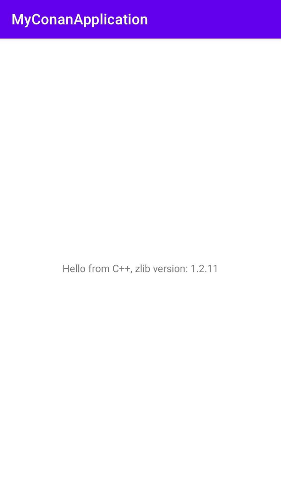
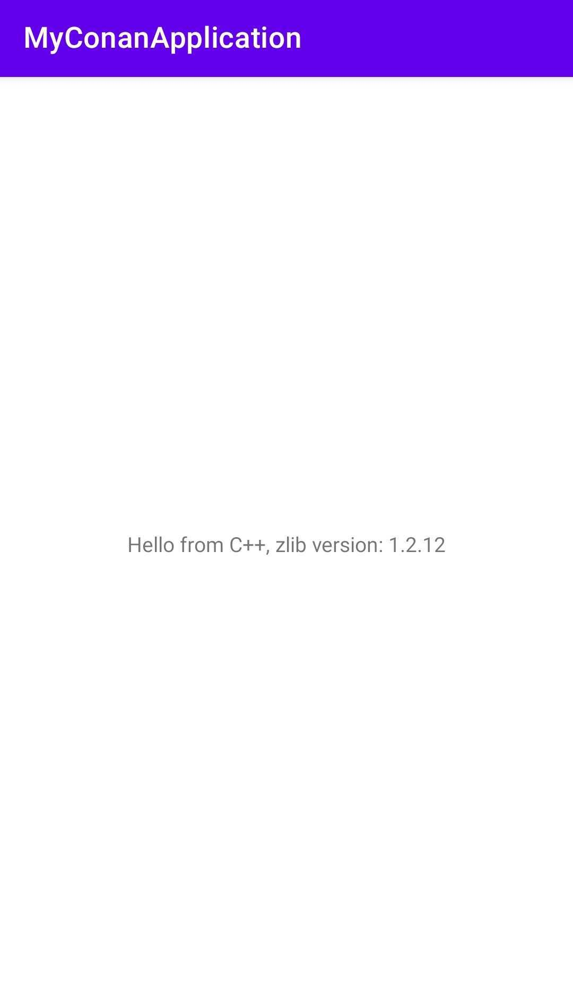

.. _examples_cross_build_android_studio:


Integrating Conan in Android Studio
===================================

At the :ref:`Cross building to Android with the NDK<examples_cross_build_android_ndk>` we learned how to build a package
for Android using the NDK. In this example we are going to learn how to do it with the Android Studio and how to use
the libraries in a real Android application.


Creating a new project
----------------------

First of all, download and install the `Android Studio IDE <https://developer.android.com/studio>`_.

Then create a ``new project`` selecting ``Native C++`` from the templates.

In the next wizard window, select a name for your application, for example `MyConanApplication`, you can leave the
"Minimum SDK" with the suggested value (21 in our case), but remember the value as we are using it later in the Conan
profile at ``os.api_level```

Select a "C++ Standard" in the next window, again, remember the choice as later we should use the same in the profile at
``compiler.cppstd``.

In the project generated with the wizard we have a folder ``cpp`` with a ``native-lib.cpp``. We are going to modify that
file to use ``zlib`` and print a message with the used ``zlib`` version. Copy only the highlighted lines, it is important
to keep the function name.


.. code-block:: c++
   :emphasize-lines: 3, 9, 10
   :caption: native-lib.cpp

    #include <jni.h>
    #include <string>
    #include "zlib.h"

    extern "C" JNIEXPORT jstring JNICALL
    Java_com_example_myconanapp_MainActivity_stringFromJNI(
            JNIEnv* env,
            jobject /* this */) {
        std::string hello = "Hello from C++, zlib version: ";
        hello.append(zlibVersion());
        return env->NewStringUTF(hello.c_str());
    }


Now we are going to learn how to introduce a requirement to the ``zlib`` library and how to prepare our project.

Introducing dependencies with Conan
-----------------------------------

conanfile.txt
^^^^^^^^^^^^^

We need to provide the ``zlib`` package with Conan. Create a file ``conanfile.txt`` in the ``cpp`` folder:


.. code-block:: text
   :caption: conanfile.txt

   [requires]
   zlib/1.2.12

   [generators]
   CMakeToolchain
   CMakeDeps

   [layout]
   cmake_layout


build.gradle
^^^^^^^^^^^^

We are going to automate calling ``conan install`` before building the Android project, so the requires are prepared,
open the ``build.gradle`` file in the ``My_Conan_App.app`` (Find it in the `Gradle Scripts` section of the Android project view).
Paste the ``task conanInstall`` contents after the ``plugins`` and before the ``android`` elements:


.. code-block:: groovy
   :caption: build.gradle


   plugins {
    ...
   }


   task conanInstall {
       def conanExecutable = "conan" // define the path to your conan installation
       def buildDir = new File("app/build")
       buildDir.mkdirs()
       ["Debug", "Release"].each { String build_type ->
           ["armv7", "armv8", "x86", "x86_64"].each { String arch ->
               def cmd = conanExecutable + " install " +
                         "../src/main/cpp --profile android -s build_type="+ build_type +" -s arch=" + arch +
                         " --build missing -c tools.cmake.cmake_layout:build_folder_vars=['settings.arch']"
               print(">> ${cmd} \n")

               def sout = new StringBuilder(), serr = new StringBuilder()
               def proc = cmd.execute(null, buildDir)
               proc.consumeProcessOutput(sout, serr)
               proc.waitFor()
               println "$sout $serr"
               if (proc.exitValue() != 0) {
                   throw new Exception("out> $sout err> $serr" + "\nCommand: ${cmd}")
               }
           }
       }
   }

   android {
       compileSdk 32

       defaultConfig {

   ...


The ``conanInstall`` task is calling :command:`conan install` for Debug/Release and for each architecture we want to build, you
can adjust these values to match your requirements.

If we focus on the ``conan install`` task we can see:

   1. We are passing a ``--profile android``, so we need to create the proile. Go to the ``profiles`` folder in the
      conan config home directory (check it running :command:`conan config home`) and create a file named ``android``
      with the following contents:

      .. code-block:: text

          include(default)

          [settings]
          os=Android
          os.api_level=21
          compiler=clang
          compiler.version=12
          compiler.libcxx=c++_static
          compiler.cppstd=14

          [conf]
          tools.android:ndk_path=/Users/luism/Library/Android/sdk/ndk/21.4.7075529/


      You might need to modify:

         - ``tools.android:ndk_path`` conf: The location of the NDK provided by Android Studio. You should be able to see the path
           to the NDK if you open the ``cpp/includes`` folder in your IDE.
         - ``compiler.version``: Check the NDK documentation or find a ``bin`` folder containing the compiler executables like
           ``x86_64-linux-android31-clang``. In a Macos installation it is found in the NDK path + ``toolchains/llvm/prebuilt/darwin-x86_64/bin``.
           Run ``./x86_64-linux-android31-clang --version`` to check the running ``clang`` version and adjust the profile.
         - ``compiler.libcxx``: The supported values are ``c++_static`` and ``c++_shared``.
         - ``compiler.cppstd``: The C++ standard version, this should be the value you selected in the Wizard.
         - ``os.api_level``: Use the same value you selected in the Wizard.

   2. We are passing ``-c tools.cmake.cmake_layout:build_folder_vars=['settings.arch']``, thanks to that, Conan will create a different
      folder for the specified ``settings.arch`` so we can have all the configurations available at the same time.


To make Conan work we need to pass CMake a custom toolchain. We can do it introducing a single line in the same file, in the
``android/defaultConfig/externalNativeBuild/cmake`` element:

.. code-block:: groovy
   :emphasize-lines: 15
   :caption: build.gradle

   android {
       compileSdk 32

       defaultConfig {
           applicationId "com.example.myconanapp"
           minSdk 21
           targetSdk 21
           versionCode 1
           versionName "1.0"

           testInstrumentationRunner "androidx.test.runner.AndroidJUnitRunner"
           externalNativeBuild {
               cmake {
                   cppFlags '-v'
                   arguments("-DCMAKE_TOOLCHAIN_FILE=conan_android_toolchain.cmake")
               }
           }


conan_android_toolchain.cmake
^^^^^^^^^^^^^^^^^^^^^^^^^^^^^

Create a file called ``conan_android_toolchain.cmake`` in the ``cpp`` folder, that file will be responsible
of including the right toolchain depending on the ``ANDROID_ABI`` variable that indicates the build configuration that
the IDE is currently running:

.. code-block:: cmake
   :caption: conan_android_toolchain.cmake


    # During multiple stages of CMake configuration, the toolchain file is processed and command-line 
    # variables may not be always available. The script exits prematurely if essential variables are absent.

    if ( NOT ANDROID_ABI OR NOT CMAKE_BUILD_TYPE )
        return()
    endif()
    if(${ANDROID_ABI} STREQUAL "x86_64")
        include("${CMAKE_CURRENT_LIST_DIR}/build/x86_64/${CMAKE_BUILD_TYPE}/generators/conan_toolchain.cmake")
    elseif(${ANDROID_ABI} STREQUAL "x86")
        include("${CMAKE_CURRENT_LIST_DIR}/build/x86/${CMAKE_BUILD_TYPE}/generators/conan_toolchain.cmake")
    elseif(${ANDROID_ABI} STREQUAL "arm64-v8a")
        include("${CMAKE_CURRENT_LIST_DIR}/build/armv8/${CMAKE_BUILD_TYPE}/generators/conan_toolchain.cmake")
    elseif(${ANDROID_ABI} STREQUAL "armeabi-v7a")
        include("${CMAKE_CURRENT_LIST_DIR}/build/armv7/${CMAKE_BUILD_TYPE}/generators/conan_toolchain.cmake")
    else()
        message(FATAL "Not supported configuration")
    endif()


CMakeLists.txt
^^^^^^^^^^^^^^

Finally, we need to modify the ``CMakeLists.txt`` to link with the ``zlib`` library:

.. code-block:: cmake
   :emphasize-lines: 7, 9
   :caption: CMakeLists.txt

   cmake_minimum_required(VERSION 3.18.1)
   project("myconanapp")
   add_library(myconanapp SHARED native-lib.cpp)

   find_library(log-lib log)

   find_package(ZLIB CONFIG)

   target_link_libraries(myconanapp ${log-lib} ZLIB::ZLIB)


Building the application
------------------------

If we build our project we can see that `conan install` is called multiple times building the different configurations
of ``zlib``.

Then if we run the application in a Virtual Device or in a real device pairing it with the QR code we can see:

|zlib1.2.11|

Once we have our project configured, it is very easy to change our dependencies and keep developing the application, for example,
we can edit the ``conanfile.txt`` file and change the ``zlib`` to the version ``1.12.2``:


.. code-block:: text

   [requires]
   zlib/1.2.12

   [generators]
   CMakeToolchain
   CMakeDeps

   [layout]
   cmake_layout


If we click build and then run the application, we will see that the zlib dependency has been updated:

|zlib1.2.12|



