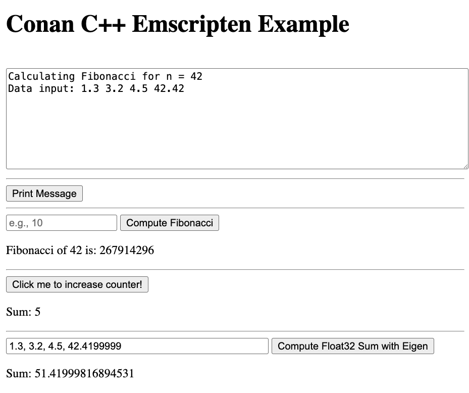
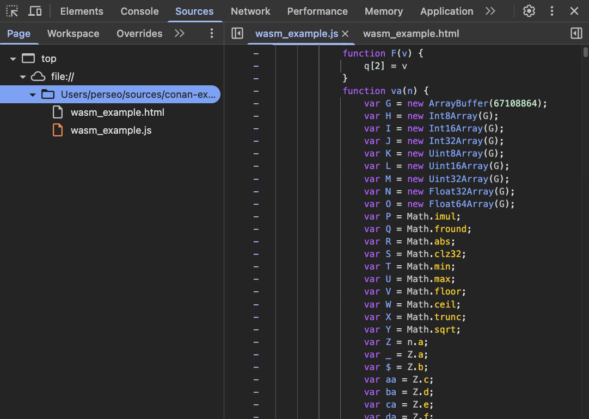

.. _examples_cross_build_emscripten:

Cross-building with Emscripten - WebAssembly and asm.js
=======================================================

This example demonstrates how to cross-build a simple C++ project using Emscripten and Conan.

Conan supports building for both `asm.js <http://asmjs.org>`_ and `WASM
<https://webassembly.org>`_, giving you the flexibility to target different
JavaScript/WebAssembly runtimes in the browser.

We recommend creating separate Conan profiles for each target. Below are
recommended profiles and instructions on how to build with them.

What’s the difference between asm.js and WASM?
----------------------------------------------

- **asm.js** is a subset of JavaScript optimized for speed. It is fully supported by all browsers (even older ones) and compiles to a large ``.js`` file.
- **WebAssembly (WASM)** is a binary format that is smaller and faster to load and execute. Most modern browsers support it, and it is generally recommended for new projects. **WASM** is also easier to integrate with native browser APIs compared to **asm.js**.

Setting up Conan profiles
-------------------------

**For asm.js (JavaScript-based output):**

.. code-block:: text

   include(default)
   [settings]
   arch=asm.js
   build_type=Release
   os=Emscripten

   [tool_requires]
   emsdk/[*]

   [conf]
   tools.build:exelinkflags=['-sALLOW_MEMORY_GROWTH=1', '-sMAXIMUM_MEMORY=2GB', '-sINITIAL_MEMORY=64MB']
   tools.build:sharedlinkflags=['-sALLOW_MEMORY_GROWTH=1', '-sMAXIMUM_MEMORY=2GB', '-sINITIAL_MEMORY=64MB']

**For WebAssembly (WASM):**

.. code-block:: text

   include(default)
   [settings]
   arch=wasm
   build_type=Release
   os=Emscripten

   [tool_requires]
   emsdk/[*]

   [conf]
   tools.build:exelinkflags=['-sALLOW_MEMORY_GROWTH=1', '-sMAXIMUM_MEMORY=4GB', '-sINITIAL_MEMORY=64MB']
   tools.build:sharedlinkflags=['-sALLOW_MEMORY_GROWTH=1', '-sMAXIMUM_MEMORY=4GB', '-sINITIAL_MEMORY=64MB']

.. note::

   ``wasm`` arch refers to ``WASM 32-bit`` target architecture, which is the
   default. If you wish to target ``WASM64``, set ``arch=wasm64`` in your profile.
   **Note that WASM64 is still experimental** and requires Node.js v20+ and a browser that supports it.

.. note::

   The profiles above use the ``emsdk`` package from Conan Center, which provides the Emscripten SDK, including ``emcc``, ``em++``, and tools like ``emrun`` and ``node``.
   
   If you prefer to use your system-installed Emscripten instead of the Conan-provided one, remove the `tool_requires` section from the profiles and instead set:
   
   .. code-block:: text

      tools.build:compiler_executables={'c':'/path/to/emcc', 'cpp':'/path/to/em++'}

.. note::
   The ``tools.build:exelinkflags`` and ``tools.build:sharedlinkflags`` in
   previous profiles are recomendations but users can modify them or define
   their values in the CMakeLists.txt file using the
   ``set_target_properties()`` command.

   - By enabling ``ALLOW_MEMORY_GROWTH`` we allow the runtime to grow its
     memory dynamically at runtime by calling ``emscripten_resize_heap()``. Without
     this flag, memory is allocated at startup and cannot grow.

   - The ``MAXIMUM_MEMORY`` and ``INITIAL_MEMORY`` values specifies the maximum
     and initial memory size for the Emscripten runtime. These values can be
     adjusted based on your application's needs. 

     Take into account that ``arch=wasm64`` has a theorical exabytes maximum
     memory size, but runtime currently limits it to 16GB, while ``arch=wasm32``
     has a maximum memory size of 4GB and ``arch=asm.js`` has a maximum memory size of 2GB.
    

Example Usage
-------------

Please, first clone the sources to recreate this project. You can find them in the
`examples2 repository <https://github.com/conan-io/examples2>`_ in GitHub:

.. code-block:: bash

    $ git clone https://github.com/conan-io/examples2.git
    $ cd examples2/examples/cross_build/emscripten/bindings

You can check the contents of the project:

..  code-block:: text

    .
    ├── CMakeLists.txt
    ├── conanfile.py
    ├── main.cpp
    ├── shell.html
    └── ...

As we can see in the conanfile and CMakeLists.txt, this project depends on an external library, `eigen <https://conan.io/center/recipes/eigen>`_.
This library is used to perform a simple floating point operation and to
demonstrate how easy it is to cross-build a project with emscripten using Conan even if it depends on external libraries.

To simplify the CMakeLists.txt, all the ``Emscripten`` specific configuration
have been moved to the conanfile.py, only one line is needed in the
CMakeLists.txt to enable the generation of the ``html`` output (testing
purposes).

The main.cpp file contains some basic functions which will be called from
JavaScript. Notice the usage of ``EMSCRIPTEN_KEEPALIVE`` specifier to ensure that
the functions are not removed by the Emscripten optimizer, allowing them to be
called from JavaScript. This could be avoided by using the ``-s EXPORTED_FUNCTIONS`` flag.

In the conanfile.py we may focus on the ``generate()`` method, more specifically in the following lines:

..  code-block:: python

    def generate(self):
        ...
        tc.extra_exelinkflags.append(
            "-sEXPORTED_FUNCTIONS=['_malloc','_free'] \
            -sEXPORTED_RUNTIME_METHODS=['ccall','cwrap','getValue','setValue','HEAPF32'] \
            -sENVIRONMENT=web \
            -sALLOW_MEMORY_GROWTH=1 \
            -sNO_EXIT_RUNTIME=1 \
            --shell-file ${CMAKE_SOURCE_DIR}/shell.html"
        )

This line is crucial as it specifies the ``Emscripten`` flags that will be used
during the linking phase. It exports the necessary functions to be callable
from JavaScript, sets the environment to web, allows memory growth, and
prevents the runtime from exiting immediately after execution.
Also, defines the ``shell.html`` file. This file will act as a ``html`` template to produce the final output.

These linker options could also be passed from CMakeLists.txt using the
``set_target_properties()`` command.

And finally, the ``shell.html`` file is a slightly modified version of the default shell packaged in ``emsdk`` with the following changes:

- Simplified to only include the necessary scripts and styles.
- Added buttons and input fields to act as a user interface for the exported functions.
- Added in the ``<script>`` section, the JavaScript code to call the exported functions
  from the C++ code, demonstrating how to interact with the compiled code.

Build the project for ``asm.js``
^^^^^^^^^^^^^^^^^^^^^^^^^^^^^^^^

Lets build the project for both targets, first for ``asm.js``:

..  code-block:: bash 
    
   $ conan build . -profile:host ../profiles/wasm32 --build=missing

.. note::

    The ``-profile:host`` option specifies the profile to use for the host system
    (in this case ``Emscripten``). Notice that we are using the profiles from
    the ``examples2`` repository, but feel free to use your own profiles or
    create new ones based on the examples provided above.

This should generate the following files in the ``build/release-asmjs/`` directory:

..  code-block:: text

    .
    ├── wasm_example.html
    ├── wasm_example.js
    └── ...

Notice that there is no ``.wasm`` file generated, as the output is in `asm.js` format. (TODO explain the differences)

This page can be opened in a browser to test the functionality of the "transpiled" code.

|bindings_webpage|

If we take a look at the `Browser Developer Tools`, on the `Sources` tab we could find the following files:

|bindings_devtools|

Notice that the `wasm_example.js` file is the JavaScript code generated by
Emscripten, which contains a javascript optimized code (improve)

Build the project for ``WebAssembly (WASM)``
^^^^^^^^^^^^^^^^^^^^^^^^^^^^^^^^^^^^^^^^^^^^

.. code-block:: bash

   $ conan build . -profile:host ../profiles/wasm32 --build=missing

This generates:

.. code-block:: text

    build/release-wasm/
    ├── wasm_example.html
    ├── wasm_example.js
    ├── wasm_example.wasm
    └── ...

Here, the ``.wasm`` file is the main compiled output, and the `.js` file is a small loader script that initializes and runs the ``WASM`` module in the browser.

Running the WebAssembly Page
----------------------------

Most browsers enforce strict security rules and will refuse to load WebAssembly
modules directly from the file system. The easiest way to run the generated
page locally is to serve it using a local server.

**Using emrun (recommended with emsdk):**

``emrun`` is provided by the ``emsdk`` Conan package and is available once the Conan build environment is activated.

Activate the environment:

**POSIX:**

.. code-block:: bash

   $ source build/release-wasm/generators/conanbuild.sh

**Windows:**

.. code-block:: bash

   $ build\release-wasm\generators\conanbuild.bat

Then:

.. code-block:: bash

   $ emrun --browser <browser_name> build/release-wasm/wasm_example.html

Replace ``<browser_name>`` with `chrome`, `firefox`, or another browser you have
installed. If you omit the ``--browser`` option, it will open the default
browser.

**Alternatively, using Python’s built-in HTTP server:**

.. code-block:: bash

   $ cd build/release-wasm
   $ python -m http.server 8080

Then open your browser and navigate to `http://localhost:8080/wasm_example.html`.

This should display the page with buttons and input fields that interact with the compiled C++ functions via JavaScript.

