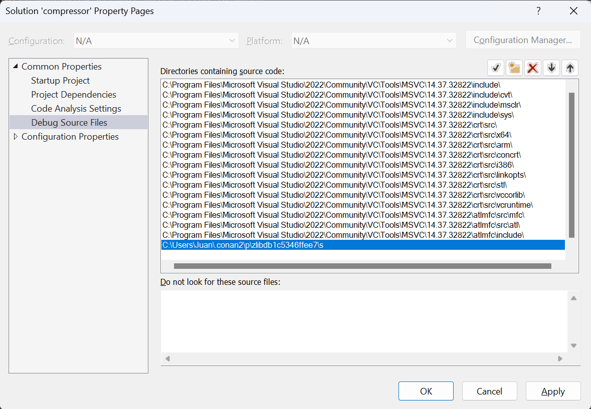

.. _examples_dev_flow_debug_visual:


Debugging shared libraries with Visual Studio
=============================================

In the previous example we discussed how to debug dependencies in Visual Studio, but when using Conan dependencies in a project it is
possible that the original build folder and build files don't exist. Conan packages don't contain the necessary
information for debugging libraries with Visual Studio by default, this information is stored in PDBs that are
generated during the compilation of the libraries. When using Conan these PDBs are generated in the build folder,
which is only needed during the building of the libraries. For that reason it's a common operation to clean the Conan
cache with ``conan cache clean`` to remove the build folder and save disk space.

For these cases where the build folder is not present we created a hook that copies the PDBs generated in the build folder to the
package folder. This behavior can't be forced by default because PDB files are usually larger than the whole package,
and it would greatly increase the package sizes.

This section will follow some examples on how to debug a project in different cases to show how users can make use of
the PDB hook.


Creating a project and debugging as usual
-----------------------------------------

First we will debug our project as usual, as it is explained in more detail in the :ref:`previous example <examples_dev_flow_debug_step_into>`
We can start building our dependencies from sources as in the previous section, only this time we will build them as
shared. To begin with, clone the sources needed for the example from the `examples2 repository <https://github.com/conan-io/examples2>`_
in GitHub and create the project.

.. code-block:: bash

    $ git clone https://github.com/conan-io/examples2.git
    $ cd examples2/tutorial/consuming_packages/simple_cmake_project
    $ conan install . -o="*:shared=True" -s build_type=Debug --build="zlib/*"
    ...
    Install finished successfully

    # CMake presets require CMake>=3.23
    $ cmake --preset=conan-default

.. note::

    We will only cover the case where the dependencies are built as shared because the PDBs and how they are linked
    to the libraries works differently for static libraries.

We can now open the solution ``compressor.sln`` to open our project in Visual Studio and debug it as explained in the
previous example. Setting a breakpoint in line 22, running the debugger and using the step into will allow us to debug
inside our dependency file ``deflate.c``.

.. image:: ../../../images/examples/dev_flow/debug_with_build_files.png
    :alt: Debugging with build files in cache

In this case the original build files were all present so the debugger worked as usual. Next we will see how the
debugger works after removing the build files from the Conan cache.


Removing build files from the Conan cache
-----------------------------------------

There are multiple reasons that can cause the build files to not be present after the dependencies are compiled. We
will clean our build files from the cache to simulate one of those cases using ``conan cache clean``. The ``--build``
flag makes sure that we only remove the build files, as we will need our source files for this example.

.. code-block:: bash

    $ conan list zlib/1.2.11:*
    $ conan cache path --folder build zlib/1.2.11:17b26a16efb893750e4481f98a154db2934ead88
    $ conan cache clean zlib/1.2.11 --build
    $ conan cache path --folder build zlib/1.2.11:17b26a16efb893750e4481f98a154db2934ead88

After closing and reopening our solution in Visual Studio, we can try to debug again. If you try to step into the
dependency, with the breakpoint on line 22, you will notice it will directly skip over to the next line as Visual Studio
doesn't have any information on the dependencies to debug.


Installing a hook to copy the PDBs to the package folder
--------------------------------------------------------

To solve the issue of not having the PDBs in the package folder, we created a hook that copies the PDBs from the build
folder to the package folder.
The hook is available in the `conan-extensions repository <https://github.com/conan-io/conan-extensions>`_.
Installing the whole repository will work, but we recommend to only install the hooks folder from the
``conan-extensions`` repository with:

.. code-block:: text

    $ conan config install https://github.com/conan-io/conan-extensions.git -sf=extensions/hooks -tf=extensions/hooks

The hook is made so it won't run by default, as it can increase the package size significantly. As explained in the
:ref:`hooks documentation <reference_extensions_hooks>`, we need to change the name of our hook to start with ``hook_``.
To locate the path where the hook was placed, run the command ``conan config home`` to find
your local cache path and go to the ``extensions/hooks`` folder to rename the ``_hook_copy_pdbs_to_package.py`` file.
Be aware that this hook will run everytime a ``package()`` method is run, to disable the hook just rename the hook back
to start with ``_hook_``.

The hook is implemented as a post-package hook, which means that it will execute after the package is created through the
``package()`` method of a recipe. This avoids any potential issue, as the order will be as follows:

- The ``build()`` method of the recipe is executed, generating the DLLs and PDBs
- The ``package()`` method of the recipe is executed, copying the necessary files to the package folder (in this case the DLLs but not the PDBs)
- The hook is executed copying the PDBs from the build folder next to its DLL for every DLL in the package

The hook makes use of the ``dumpbin`` tool which is included in the Visual Studio installation. This tool allows us
to get information of a DLL, in this case the path where its associated PDB is located. It will be used for every DLL
in the package to locate its PDB to copy it to the package folder.

For more information on how PDBs work with Visual and how we used it to create the hook can be found in the
`hook readme <https://github.com/conan-io/conan-extensions/blob/main/hooks/README.md>`_.

Debugging without build files
-----------------------------

After installing the hook we will create again the project from sources so the hook can now copy the PDBs to the package
folder alongside the package DLLs so they can be found by the debugger.

.. code-block:: bash

    $ conan install . -o="*:shared=True" -s build_type=Debug --build="zlib/*"
    ...
    zlib/1.2.11: Calling package()
    ...
    [HOOK - hook_copy_pdbs_to_package.py] post_package(): PDBs post package hook running
    ...
    Install finished successfully

    # CMake presets require CMake>=3.23
    $ cmake --preset=conan-default

Notice that when running the conan install now you will see the outputs of the hook running after the call to ``package()``.
To test the hook we can clean the cache again to remove the build files, this includes the sources used to build the
library and the PDBs that were originally generated.

.. code-block:: bash

    $ conan cache clean zlib/1.2.11 --build

Open the solution in Visual Studio again and start the debugger. When you try to step into the dependency in line 22, an error
message will pop up telling us the file was not found and it will ask where the file is located. We can close this window
and it will give the option to view the disassembly which can be debugged thanks to the PDB. The PDB only contains the
debugging information but Visual Studio is missing the source files, so it won't be able to debug over those as it did
initially.

.. image:: ../../../images/examples/dev_flow/source_file_not_found.png
    :alt: Debugging without build files in cache


Locating the sources path for the debugger
------------------------------------------

Visual Studio won't be able to find te source files by itself after deleting the original build files. To be able to
debug over the source files, there's an option to manually set the source folder path so that it's possible to debug over the source files. This
requires that the source files for the dependency exist. In our case we can get the location of this source files
by running a ```conan cache path``.

.. code-block::

    $ conan cache path --folder source zlib/1.2.11

In case this source path is not present we can use a config to download the sources again.

.. code-block::

    $ conan install . -o="*:shared=True" -s build_type=Debug -c:a="tools.build:download_source=True"

Once we have the source path we can set it in Visual Studio so the debugger can find the source files. Right click on
the solution in the Solution Explorer and select Properties. Go to Debug Source Files in the Common Properties section
and add our source path.



Starting the debugger again will allow to step into the code of the dependency as in the first example we did.

.. note::

    If there are patches to the source files we won't be able to debug over the modified files, as we are using the
    files from the source folder and the patches are applied in a later step right before being compiled in the build folder.

    Any modification to the source files will not allow debugging over them, as Visual Studio does a checksum check, so
    they need to be the exact same files as when the libraries were compiled.


