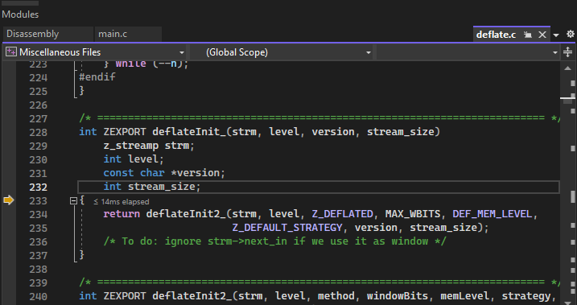
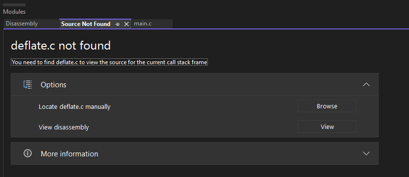

.. _examples_dev_flow_debug_visual:


Debugging shared libraries with Visual Studio
=============================================

We previously discussed how to debug dependencies in Visual Studio, but when creating your project with Conan is
possible that the original build folder and build files don't exist. Conan packages don't contain the necessary
information for debugging libraries with Visual Studio by default, this information is stored in PDBs that are generated during the
compilation of the libraries. When using Conan these PDBs are generated in the build folder, which is generated during
the building of the libraries and it's no longer needed afterwards. For example, cleaning the Conan cache with
``conan cache clean`` will remove the build folder.

The goal is to store the necessary PDB files in the package folder to make sure they are always present and don't depend on the
existence of the build folder. To solve this we created a hook that copies the PDBs created in the build folder to the
package folder. This behavior can't be forced by default because PDB files are usually larger than the whole package,
and it would greatly increase the package sizes.

For more information about how PDBs work, check the :ref:`PDBs and how to locate them section <examples_dev_flow_debug_visual_pdb>`
below.


Creating a project and debugging as usual
-----------------------------------------

We are going to show some examples on how to debug a project in different cases to show how the PDBs hook could help users.
First we will debug our project as usual, as it is explained in more detail in the :ref:`previous example <examples_dev_flow_debug_step_into>`
We can start building our dependencies from sources as in the previous section, only this time we will build them as
shared. To begin with, clone the sources for the example from the `examples2 repository <https://github.com/conan-io/examples2>`_
in GitHub and create the project.

.. code-block:: bash

    $ git clone https://github.com/conan-io/examples2.git
    $ cd examples2/tutorial/consuming_packages/simple_cmake_project
    $ conan install . -o="*:shared=True" -s build_type=Debug --build="zlib/*"
    ...
    Install finished successfully

    # CMake presets require CMake>=3.23
    $ cmake --preset=conan-default

We can now open the solution ``compressor.sln`` to open our project in Visual Studio and debug it as explained in the
previous example. Setting a breakpoint in line 22, running the debugger and
using the step into will allow us to debug inside our dependency file ``deflate.c``.




Removing build files from the Conan cache
-----------------------------------------

There are multiple reasons that can cause the build files to not be present after the dependencies are compiled. We
will clean our build files from the cache to simulate one of those cases using ``conan cache clean``. The ``--build``
flag makes sure that we only remove the build files, as we will need our source files for this example.

.. code-block:: bash

    $ conan list zlib/1.2.11:*
    $ conan cache path --folder build zlib/1.2.11:17b26a16efb893750e4481f98a154db2934ead88
    $ conan cache clean zlib/1.2.11 --build
    $ conan cache path --folder build zlib/1.2.11:17b26a16efb893750e4481f98a154db2934ead88

After closing and reopening our solution in Visual Studio, we can try to debug again. If you try to step into the
dependency, with the breakpoint on line 22, you will notice it will directly skip over to the next line as Visual Studio
doesn't have any information on the dependencies to debug.


Installing a hook to copy the PDBs to the package folder
--------------------------------------------------------

The hook is available in the `conan-extensions repository <https://github.com/conan-io/conan-extensions>`_.
Installing the whole repository will work, but we recommend to only install the hooks folder from the
``conan-extensions`` repository with:

.. code-block:: text

    $ conan config install https://github.com/conan-io/conan-extensions.git -sf=extensions/hooks -tf=extensions/hooks

The hook is made so it won't run by default, as it can increase the package size significantly. As explained in the
:ref:`hooks documentation <reference_extensions_hooks>`, we need to change the name of our hook to start with ``hook_``.
To locate the path where the hook was placed, run the command ``conan config home`` to find
your local cache path and go to the ``extensions/hooks`` folder to rename the ``_hook_copy_pdbs_to_package.py`` file.
Be aware that this hook will run everytime a ``package()`` method is run, to disable the hook just rename the hook back
to start with ``_hook_``.

The hook is implemented as a post-package hook, which means that it will execute after the package is created through the
``package()`` method of a recipe. This avoids any potential issue, as the order will be as follows:

- The ``build()`` method of the recipe is executed, generating the DLLs and PDBs
- The ``package()`` method of the recipe is executed, copying the necessary files to the package folder (in this case the DLLs but not the PDBs)
- The hook is executed copying the PDBs from the build folder next to its DLL for every DLL in the package

.. _examples_dev_flow_debug_visual_pdb:

PDBs and how to locate them
---------------------------

A PDB has the information to link the source code of a debuggable object to the Visual Studio debugger. Each PDB is linked to a
specific file (executable or library) and contains the source file name and line numbers to display in the IDE.
When compiling the files in Debug mode the created binary will contain the information of where the PDB will be
generated, which by default is the same path where the file is being compiled. The PDBs are created by the ``cl.exe``
compiler with the ``/Zi`` flag, or by the ``link.exe`` when linking a DLL or executable.

When a DLL is created it contains the information of the path where its corresponding PDB was generated. This can be
manually checked by running the following commands:

.. code-block:: text

    $ "%ProgramFiles(x86)%\Microsoft Visual Studio\Installer\vswhere.exe" -find "**\dumpbin.exe"
    C:\Program Files\Microsoft Visual Studio\2022\Community\VC\Tools\MSVC\14.16.27023\bin\HostX64\x64\dumpbin.exe

    # Use the path for the dumpbin.exe that you got from the previous command
    $ "C:\Program Files\Microsoft Visual Studio\2022\Community\VC\Tools\MSVC\14.16.27023\bin\HostX64\x64\dumpbin.exe" /PDBPATH <dll_path>
    ...
    Dump of file .\bin\zlib1.dll

    File Type: DLL
    PDB file found at 'C:\Users\{user}\.conan2\p\b\zlib78326f0099328\p\bin\zlib1.pdb'
    ...

First we locate the ``dumpbin.exe`` path with the ``vswhere`` tool and then we run the command passing a DLL path,
which will return the information of the PDB path. We can find the path to the DLLs of our example with the help of the
``conan cache path`` command by passing to it the generated package id.

PDBs are created when compiling a library or executable in Debug mode. They are created by default in the same directory
as the file it is associated with. This means that when using Conan they will be created in the build directory in the
same path as the DLLS.

When using the Visual Studio debugger, it will look for PDBs to load in the following paths:

- The project folder.
- The original path where the associated file was compiled.
- The path where Visual is currently finding the compiled file, in our case the DLL in the package folder.

The PDB has by default the same name as its associated file, so Visual will look for it based on the name of the DLL.

.. note::

    PDBs can sometimes be generated for LIB files, but for now the feature only focuses on shared libraries and work with
    PDBs generated for DLLs.


Debugging without build files
-----------------------------

After installing the hook we will create again the project from sources so the hook can now copy the PDBs to the package
folder alongside the package DLLs so they can be found by the debugger.

.. code-block:: bash

    $ conan install . -o="*:shared=True" -s build_type=Debug --build="zlib/*"
    ...
    zlib/1.2.11: Calling package()
    ...
    [HOOK - hook_copy_pdbs_to_package.py] post_package(): PDBs post package hook running
    ...
    Install finished successfully

    # CMake presets require CMake>=3.23
    $ cmake --preset=conan-default

Notice that when running the conan install now you will see the outputs of the hook running after the call to package().
To test the hook we can clean the cache again to remove the build files, this includes the sources used to build the
library and the PDBs that were originally generated.

.. code-block:: bash

    $ conan cache clean zlib/1.2.11 --build

Open the solution in Visual Studio again and start the debugger. When you try to step into the dependency in line 22, an error
message will pop up telling us the file was not found and it will ask where the file is located. We can close this window
and it will give the option to view the disassembly which can be debugged thanks to the PDB. The PDB only contains the
debugging information but Visual Studio is missing the source files, so it won't be able to debug over those as it did
initially.




Locating the sources path for the debugger
------------------------------------------

Visual Studio won't be able to find te source files by itself after deleting the original build files. To be able to
debug over the source files, there's an option to manually set the source folder path so that it's possible to debug over the source files. This
requires that the source files for the dependency exist. In our case we can get the location of this source files
by running a ```conan cache path``.

.. code-block::

    $ conan cache path --folder source zlib/1.2.11

In case this source path is not present we can use a config to download the sources again.

.. code-block::

    $ conan install . -o="*:shared=True" -s build_type=Debug -c:a="tools.build:download_source=True"

Once we have the source path we can set it in Visual Studio so the debugger can find the source files. Right click on
the solution in the Solution Explorer and select Properties. Go to Debug Source Files in the Common Properties section
and add our source path.

.. image:: ../../../images/examples/dev_flow/add_path_to_debug_source_files.png
    :alt: Setting source path

Starting the debugger again will allow to step into the code of the dependency as in the first example we did.

.. note::

    If there are patches to the source files we won't be able to debug over the modified files, as we are using the
    files from the source folder and the patches are applied in a later step right before being compiled in the build folder.

    Any modification to the source files will not allow debugging over them, as Visual Studio does a checksum check, so
    they need to be the exact same files as when the libraries were compiled.


