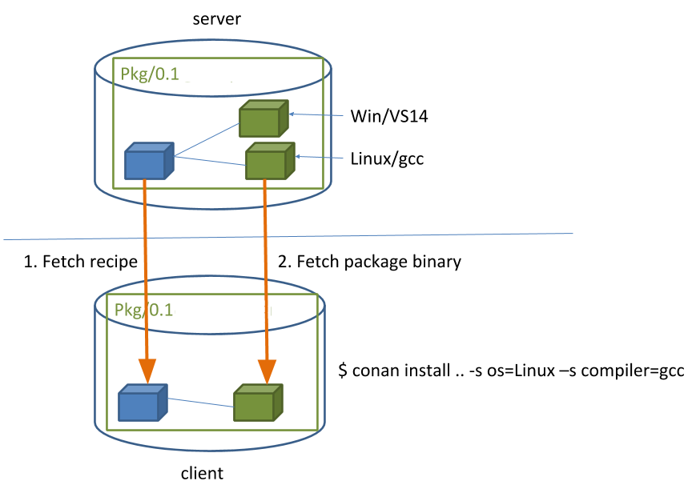

.. _getting_started:

Getting Started
===============

Let's get started with an example: We are going to create an MD5 hash calculator app that uses one of the
most popular C++ libraries: Poco_.

We'll use CMake as build system in this case but keep in mind that Conan **works with any build
system** and is not limited to using CMake.

Make sure you are running the latest Conan version. Read the :ref:`Conan update<conan_update>`
section get more information.

An MD5 hash calculator using the Poco Libraries
-----------------------------------------------

.. note::

    The source files to recreate this project are available in the `example repository`_ in GitHub.
    You can skip the manual creation of the folder and sources with this command:

    .. code-block:: bash

        $ git clone https://github.com/conan-io/examples.git && cd examples/libraries/poco/md5

1. Create the following source file inside a folder. This will be the source file of our application:

    .. code-block:: cpp
       :caption: **md5.cpp**

        #include "Poco/MD5Engine.h"
        #include "Poco/DigestStream.h"

        #include <iostream>

        int main(int argc, char** argv)
        {
            Poco::MD5Engine md5;
            Poco::DigestOutputStream ds(md5);
            ds << "abcdefghijklmnopqrstuvwxyz";
            ds.close();
            std::cout << Poco::DigestEngine::digestToHex(md5.digest()) << std::endl;
            return 0;
        }

2. We know that our application relies on the Poco libraries. Let's look for it in the Conan Center remote:

    .. code-block:: bash

        $ conan search poco --remote=conan-center
        Existing package recipes:

        poco/1.8.1
        poco/1.9.3
        poco/1.9.4

    Conan remotes must be specified in search. It will otherwise only search local cache.

3. We got some interesting references for Poco. Let's inspect the metadata of the 1.9.4 version:

    .. code-block:: bash

        $ conan inspect poco/1.9.4
        name: poco
        version: 1.9.4
        url: https://github.com/conan-io/conan-center-index
        homepage: https://pocoproject.org
        license: BSL-1.0
        author: None
        description: Modern, powerful open source C++ class libraries for building network- and internet-based applications that run on desktop, server, mobile and embedded systems.
        topics: ('conan', 'poco', 'building', 'networking', 'server', 'mobile', 'embedded')
        generators: cmake
        exports: None
        exports_sources: CMakeLists.txt
        short_paths: False
        apply_env: True
        build_policy: None
        revision_mode: hash
        settings: ('os', 'arch', 'compiler', 'build_type')
        options:
            cxx_14: [True, False]
            enable_apacheconnector: [True, False]
            enable_cppparser: [True, False]
            enable_crypto: [True, False]
            [...]
        default_options:
            cxx_14: False
            enable_apacheconnector: False
            enable_cppparser: False
            enable_crypto: True
            [...]

4. Ok, it looks like this dependency could work with our hash calculator app. We should indicate which are
   the requirements and the generator for our build system. Let's create a *conanfile.txt* inside our
   project's folder with the following content:

    .. code-block:: text
       :caption: **conanfile.txt**

        [requires]
        poco/1.9.4

        [generators]
        cmake

    In this example we are using CMake to build the project, which is why the ``cmake`` generator is
    specified. This generator creates a *conanbuildinfo.cmake* file that defines CMake variables
    including paths and library names that can be used in our build. Read more about
    :ref:`generators_reference`.

5. Next step: We are going to install the required dependencies and generate the information for the build system:

    .. important::

        If you are using **GCC compiler >= 5.1**, Conan will set the ``compiler.libcxx`` to the old
        ABI for backwards compatibility. You can change this with the following commands:

        .. code-block:: bash

            $ conan profile new default --detect  # Generates default profile detecting GCC and sets old ABI
            $ conan profile update settings.compiler.libcxx=libstdc++11 default  # Sets libcxx to C++11 ABI

        You will find more information in :ref:`manage_gcc_abi`.

    .. code-block:: bash

        $ mkdir build && cd build
        $ conan install ..
        ...
        Requirements
            openssl/1.0.2t from 'conan-center' - Downloaded
            poco/1.9.4 from 'conan-center' - Downloaded
            zlib/1.2.11 from 'conan-center' - Downloaded
        Packages
            openssl/1.0.2t:eb50d18a5a5d59bd0c332464a4c348ab65e353bf - Download
            poco/1.9.4:645aaff0a79e6036c77803601e44677556109dd9 - Download
            zlib/1.2.11:f74366f76f700cc6e991285892ad7a23c30e6d47 - Download

        zlib/1.2.11: Retrieving package f74366f76f700cc6e991285892ad7a23c30e6d47 from remote 'conan-center'
        Downloading conanmanifest.txt completed [0.25k]
        Downloading conaninfo.txt completed [0.44k]
        Downloading conan_package.tgz completed [83.15k]
        Decompressing conan_package.tgz completed [0.00k]
        zlib/1.2.11: Package installed f74366f76f700cc6e991285892ad7a23c30e6d47
        zlib/1.2.11: Downloaded package revision 0
        openssl/1.0.2t: Retrieving package eb50d18a5a5d59bd0c332464a4c348ab65e353bf from remote 'conan-center'
        Downloading conanmanifest.txt completed [4.92k]
        Downloading conaninfo.txt completed [1.28k]
        Downloading conan_package.tgz completed [3048.81k]
        Decompressing conan_package.tgz completed [0.00k]
        openssl/1.0.2t: Package installed eb50d18a5a5d59bd0c332464a4c348ab65e353bf
        openssl/1.0.2t: Downloaded package revision 0
        poco/1.9.4: Retrieving package 645aaff0a79e6036c77803601e44677556109dd9 from remote 'conan-center'
        Downloading conanmanifest.txt completed [48.75k]
        Downloading conaninfo.txt completed [2.44k]
        Downloading conan_package.tgz completed [5128.39k]
        Decompressing conan_package.tgz completed [0.00k]
        poco/1.9.4: Package installed 645aaff0a79e6036c77803601e44677556109dd9
        poco/1.9.4: Downloaded package revision 0
        conanfile.txt: Generator cmake created conanbuildinfo.cmake
        conanfile.txt: Generator txt created conanbuildinfo.txt
        conanfile.txt: Generated conaninfo.txt
        conanfile.txt: Generated graphinfo

    Conan installed our Poco dependency but also the **transitive dependencies** for it: OpenSSL and zlib. It has also generated a
    *conanbuildinfo.cmake* file for our build system.

6. Now let's create our build file. To inject the Conan information, include the generated *conanbuildinfo.cmake* file like this:

    .. code-block:: cmake
       :caption: **CMakeLists.txt**

        cmake_minimum_required(VERSION 2.8.12)
        project(MD5Encrypter)

        add_definitions("-std=c++11")

        include(${CMAKE_BINARY_DIR}/conanbuildinfo.cmake)
        conan_basic_setup()

        add_executable(md5 md5.cpp)
        target_link_libraries(md5 ${CONAN_LIBS})

7. Now we are ready to build and run our Encrypter app:

    .. code-block:: bash

        (win)
        $ cmake .. -G "Visual Studio 16"
        $ cmake --build . --config Release

        (linux, mac)
        $ cmake .. -G "Unix Makefiles" -DCMAKE_BUILD_TYPE=Release
        $ cmake --build .
        ...
        [100%] Built target md5
        $ ./bin/md5
        c3fcd3d76192e4007dfb496cca67e13b

Installing Dependencies
-----------------------

The :command:`conan install` command downloads the binary package required for your configuration (detected the first time you ran the
command), **together with other (transitively required by Poco) libraries, like OpenSSL and Zlib**. It will also create the
*conanbuildinfo.cmake* file in the current directory, in which you can see the CMake variables, and a *conaninfo.txt* in which the settings,
requirements and optional information is saved.

.. note::
    Conan generates a :ref:`default profile <default_profile>` with your detected settings (OS, compiler, architecture...) and that
    configuration is printed at the top of every :command:`conan install` command. However, it is strongly recommended to review it and
    adjust the settings to accurately describe your system as shown in the :ref:`getting_started_other_configurations` section.

It is very important to understand the installation process. When the :command:`conan install` command runs, settings specified on the
command line or taken from the defaults in *<userhome>/.conan/profiles/default* file are applied.

For example, the command :command:`conan install .. --settings os="Linux" --settings compiler="gcc"`, performs these steps:

- Checks if the package recipe (for ``poco/1.9.4`` package) exists in the local cache. If we are just starting, the
  cache is empty.
- Looks for the package recipe in the defined remotes. Conan comes with `conan-center`_ Bintray remote as the default, but can be changed.
- If the recipe exists, the Conan client fetches and stores it in your local cache.
- With the package recipe and the input settings (Linux, GCC), Conan looks for the corresponding binary in the local cache.
- Then Conan searches the corresponding binary package in the remote and fetches it.
- Finally, it generates an appropriate file for the build system specified in the ``[generators]`` section.

There are binaries for several mainstream compilers and versions available in Conan Center repository in Bintray, such as Visual Studio 14,
15, Linux GCC 4.9 and Apple Clang 3.5... Conan will throw an error if the binary package required for specific settings doesn't exist. You
can build the binary package from sources using :command:`conan install .. --build=missing`, it will succeed if your configuration is
supported by the recipe. You will find more info in the :ref:`getting_started_other_configurations` section.

Inspecting Dependencies
-----------------------

The retrieved packages are installed to your local user cache (typically *.conan/data*), and can be reused from this location for other
projects. This allows to clean your current project and continue working even without network connection. To search for packages in the
local cache run:

.. code-block:: bash

    $ conan search "*"
    Existing package recipes:

    openssl/1.0.2t
    poco/1.9.4
    zlib/1.2.11

To inspect the different binary packages of a reference run:

.. code-block:: bash

    $ conan search poco/1.9.4@
    Existing packages for recipe poco/1.9.4:

    Package_ID: 645aaff0a79e6036c77803601e44677556109dd9
        [options]
            cxx_14: False
            enable_apacheconnector: False
            enable_cppparser: False
            enable_crypto: True
            enable_data: True
    ...

The ``@`` symbol at the end of the package name is important to search for a specific package. If you
don't add the ``@``, Conan will interpret the argument as a pattern search and return all the
packages that match the ``poco/1.9.4`` pattern and may have different :ref:`user and channel
<user_channel>`.

To inspect all your current project's dependencies use the :command:`conan info` command by pointing it to the location of the
*conanfile.txt* folder:

.. code-block:: bash

    $ conan info ..
    conanfile.txt
        ID: db91af4811b080e02ebe5a626f1d256bb90d5223
        BuildID: None
        Requires:
            poco/1.9.4
    openssl/1.0.2t
        ID: eb50d18a5a5d59bd0c332464a4c348ab65e353bf
        BuildID: None
        Remote: conan-center=https://api.bintray.com/conan/conan/conan-center
        URL: https://github.com/conan-io/conan-center-index
        Homepage: https://github.com/openssl/openssl
        License: OpenSSL
        Topics: conan, openssl, ssl, tls, encryption, security
        Recipe: Cache
        Binary: Cache
        Binary remote: conan-center
        Creation date: 2019-11-13 23:14:37
        Required by:
            poco/1.9.4
        Requires:
            zlib/1.2.11
    poco/1.9.4
        ID: 645aaff0a79e6036c77803601e44677556109dd9
        BuildID: None
        Remote: conan-center=https://api.bintray.com/conan/conan/conan-center
        URL: https://github.com/conan-io/conan-center-index
        Homepage: https://pocoproject.org
        License: BSL-1.0
        Topics: conan, poco, building, networking, server, mobile, embedded
        Recipe: Cache
        Binary: Cache
        Binary remote: conan-center
        Creation date: 2020-01-07 17:29:24
        Required by:
            conanfile.txt
        Requires:
            openssl/1.0.2t
    zlib/1.2.11
        ID: f74366f76f700cc6e991285892ad7a23c30e6d47
        BuildID: None
        Remote: conan-center=https://api.bintray.com/conan/conan/conan-center
        URL: https://github.com/conan-io/conan-center-index
        Homepage: https://zlib.net
        License: Zlib
        Recipe: Cache
        Binary: Cache
        Binary remote: conan-center
        Creation date: 2020-01-07 17:01:29
        Required by:
            openssl/1.0.2t

Or generate a graph of your dependencies using Dot or HTML formats:

.. code-block:: bash

    $ conan info .. --graph=file.html
    $ file.html # or open the file, double-click

.. image:: /images/conan-info_deps_html_graph.png
    :height: 310 px
    :width: 200 px
    :align: center

Searching Packages
------------------

The remote repository where packages are installed from is configured by default in Conan. It is called Conan Center (configured as
:command:`conan-center` remote) and it is located in Bintray_.

You can search packages in Conan Center using this command:

.. code-block:: bash

    $ conan search open* --remote=conan-center
    Existing package recipes:

    openal/1.18.2@bincrafters/stable
    openal/1.19.0@bincrafters/stable
    openal/1.19.1
    opencv/2.4.13.5@conan/stable
    opencv/3.4.3@conan/stable
    opencv/3.4.5@conan/stable
    opencv/4.0.0@conan/stable
    opencv/4.0.1@conan/stable
    opencv/4.1.0@conan/stable
    opencv/4.1.1@conan/stable
    openexr/2.3.0
    openexr/2.3.0@conan/stable
    openexr/2.4.0
    openjpeg/2.3.0@bincrafters/stable
    openjpeg/2.3.1
    openjpeg/2.3.1@bincrafters/stable
    openssl/1.0.2s
    ...

As you can see, some of the libraries end with a ``@`` symbol followed by two strings separated by a
slash. These fields are the :ref:`user and channel <user_channel>` for the Conan package, and they are
useful if you want to make specific changes and disambiguate your modified recipe from the one in the
Conan Center or any other remote.

There are additional community repositories that can be configured and used. See :ref:`Bintray Repositories <bintray_repositories>` for more
information.

.. _getting_started_other_configurations:

Building with Other Configurations
----------------------------------

In this example, we have built our project using the default configuration detected by Conan. This configuration is known as the
:ref:`default profile <default_profile>`.

A profile needs to be available prior to running commands such as :command:`conan install`. When running the command, your settings are
automatically detected (compiler, architecture...) and stored as the default profile. You can edit these settings
*~/.conan/profiles/default* or create new profiles with your desired configuration.

For example, if we have a profile with a 32-bit GCC configuration in a profile called *gcc_x86*, we can run the following:

.. code-block:: bash

    $ conan install .. --profile=gcc_x86

.. tip::

    We strongly recommend using :ref:`profiles` and managing them with :ref:`conan_config_install`.

However, the user can always override the profile settings in the :command:`conan install` command using the :command:`--settings`
parameter. As an exercise, try building the 32-bit version of the hash calculator project like this:

.. code-block:: bash

    $ conan install .. --settings arch=x86

The above command installs a different package, using the :command:`--settings arch=x86` instead of the one of the default profile used
previously.

To use the 32-bit binaries, you will also have to change your project build:

- In Windows, change the CMake invocation to ``Visual Studio 14``.
- In Linux, you have to add the ``-m32`` flag to your ``CMakeLists.txt`` by running ``SET(CMAKE_CXX_FLAGS "${CMAKE_CXX_FLAGS} -m32")``, and
  the same applies to ``CMAKE_C_FLAGS, CMAKE_SHARED_LINK_FLAGS and CMAKE_EXE_LINKER_FLAGS``. This can also be done more easily, by
  automatically using Conan, as we'll show later.
- In macOS, you need to add the definition ``-DCMAKE_OSX_ARCHITECTURES=i386``.

Got any doubts? Check our :ref:`faq`, |write_us| or join the community in `Cpplang Slack`_ ``#conan`` channel!

.. |write_us| raw:: html

   <a href="mailto:info@conan.io" target="_blank">write us</a>

.. _`Poco`: https://pocoproject.org/

.. _`conan-center`: https://bintray.com/conan/conan-center

.. _`Bintray`: https://bintray.com/conan/conan-center

.. _`Cpplang Slack`: https://cpplang.now.sh/

.. _`example repository`: https://github.com/conan-io/examples
