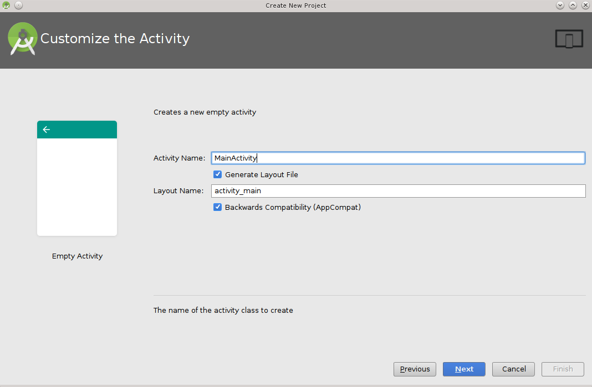

.. _android_studio:

|android_studio_logo| Android Studio
____________________________________

Use can use Conan to :ref:`cross-build your libraries for Android<cross_building_android>` in different architectures.
If you are using Android Studio for your Android application development, you can integrate it conan to automate the
library building for the different architectures that you want to support in your project.

Here is an example of how to integrate the ``libpng`` conan package library in an Android application, but any library
that can be cross-compiled to Android could be used using the same procedure.

We are going to start from the "Hello World" wizard application and then will add it the ``libpng`` C library:

1. Create a new Android Studio project and include C++ support.

|wizard1|

2 Select your API level and target.

|wizard2|

3. Add an empty Activity and name it.

|wizard3|
|wizard4|

4. Select the C++ Standard

|wizard5|

5. Change to the `project view` and in the `app` folder create a ``conanfile.txt`` and ``conan_android_profile`` files with
the following contents:

|wizard7|

**conanfile.txt**

.. code-block:: text

    [requires]
    libpng/1.6.23@lasote/testing

    [generators]
    cmake

**conan_android_profile**

.. code-block:: text

    [settings]
    os=Android
    compiler=clang
    compiler.version=3.8
    compiler.libcxx=libstdc++

    [options]
    # Linux:
    android-toolchain:ndk_path=~/Android/Sdk/ndk-bundle
    # Windows:
    # android-toolchain:ndk_path=~/AppData/local/Android/Sdk/ndk-bundle
    # OSX:
    # android-toolchain:ndk_path=~/Library/Android/sdk/ndk-bundle

    [build_requires]
    *:android-toolchain/r13b@lasote/testing

You need to adjust the **android-toolchain:ndk_path** variable in the ``[options]`` section to point to the Android NDK installed
by your Android Studio. It's usually downloaded in the first project build. The default paths for the NDK are:

- **Linux**: `~/Android/Sdk/ndk-bundle`
- **Windows**: `~/AppData/local/Android/Sdk/ndk-bundle`
- **OSX**: `~/Library/Android/sdk/ndk-bundle`

We are using the **build_requires** feature to include the recipe ``android-toolchain/r13b@lasote/testing``.
That recipe will create a specific toolchain for our settings and will prepare
some environment variables (CC, CXX, PATH, CONAN_CMAKE_FIND_ROOT_PATH...) and propagate some c/cpp flags.
It allows to automatically prepare your build system to use the Android toolchain and cross-build the libraries
from the ``[requires]`` section of the ``conanfile.txt`` file for the Android operating system. All in a transparent
manner.

Once our ``[requires]`` are built, the android-toolchain recipe it not used anymore.

6. Open the ``CMakeLists.txt`` file from the app folder and replace the contents with:

.. code-block:: text

    cmake_minimum_required(VERSION 3.4.1)

    include(${CMAKE_CURRENT_SOURCE_DIR}/conan/${ANDROID_ABI}/conanbuildinfo.cmake)
    conan_basic_setup()

    add_library(native-lib SHARED src/main/cpp/native-lib.cpp)
    target_link_libraries(native-lib ${CONAN_LIBS})

7. Open the ``build.gradle`` file, we are configuring the architectures we want to build specifying the **abiFilters**,
and adding a new task ``conanInstall`` that will call ``conan install`` command for every architecture we have specified
in the abiFilters:

|wizard8|

**build.gradle, in the defaultConfig section, append:**

.. code-block:: groovy

    ndk {
       // Specifies the ABI configurations of your native
       // libraries Gradle should build and package with your APK.
       abiFilters 'armeabi-v7a', 'x86', 'armeabi' // 'arm64-v8a', mips', ‘x86_64’
    }

**build.gradle, after the android block:**

.. code-block:: groovy

    task conanInstall {
       def CONAN_ARCHS_MAP = ["armeabi-v7a":'armv7', "armeabi":'armv6', "arm64-v8a": "armv8"]
       def api_level = android.defaultConfig.minSdkVersion.mApiLevel
       android.defaultConfig.ndk.abiFilters.each {
           def arch = CONAN_ARCHS_MAP.get(it, it)
           def build_dir = new File("app/conan/$it")
           build_dir.mkdirs()
           // if you have problems running the command try to specify the absolute
           // path to conan (Known problem in MacOSX)
           def cmd = "conan install --file ../../conanfile.txt " +
                   "--profile ../../conan_android_profile " + // base android profile
                   "-s arch=${arch} -s os.api_level=${api_level} " + // Adjust api level and architecture
                   " --build missing " // Build from sources automatically if needed.
           print(">> ${cmd} \n")

           def sout = new StringBuilder(), serr = new StringBuilder()
           def proc = cmd.execute(null, build_dir)
           proc.consumeProcessOutput(sout, serr)
           proc.waitFor()
           println "$sout $serr"
           if(proc.exitValue() != 0){
               throw new Exception("out> $sout err> $serr" + "\nCommand: ${cmd}")
           }
       }
    }

8. Finally open the default example cpp library in ``app/src/main/cpp/native-lib.cpp`` and include some lines using your library.
   Be careful with the JNICALL name if you used other app name in the wizard:

.. code-block:: cpp

    #include <jni.h>
    #include <string>
    #include "png.h"
    #include "zlib.h"
    #include <sstream>
    #include <iostream>

    extern "C"
    JNIEXPORT jstring JNICALL
    Java_com_jfrog_myconanandroidcppapp_MainActivity_stringFromJNI(
           JNIEnv *env,
           jobject /* this */) {
       std::ostringstream oss;
       oss << "Compiled with libpng: " << PNG_LIBPNG_VER_STRING << std::endl;
       oss << "Running with libpng: " << png_libpng_ver << std::endl;
       oss << "Compiled with zlib: " << ZLIB_VERSION << std::endl;
       oss << "Running with zlib: " << zlib_version << std::endl;

       return env->NewStringUTF(oss.str().c_str());
    }

Build your project normally, conan will create a “conan” folder with a folder for each different architecture you have speified in the abiFilters with a ``conanbuildinfo.cmake`` file.

Then run the app using an x86 emulator for best performance:

|wizard9|

.. seealso:: Check the section :ref:`howtos/Cross building/Android <cross_building_android>` to read more about cross
             building for Android.

.. |wizard1| image:: ../images/android_studio/wizard1.png
.. |wizard2| image:: ../images/android_studio/wizard2.png
.. |wizard3| image:: ../images/android_studio/wizard3.png

.. |wizard5| image:: ../images/android_studio/wizard5.png
.. |wizard6| image:: ../images/android_studio/wizard6.png

.. |wizard9| image:: ../images/android_studio/wizard9.png

