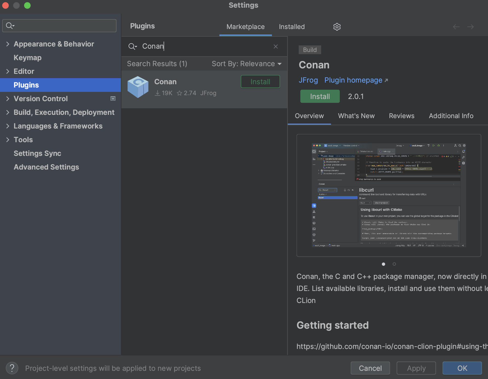
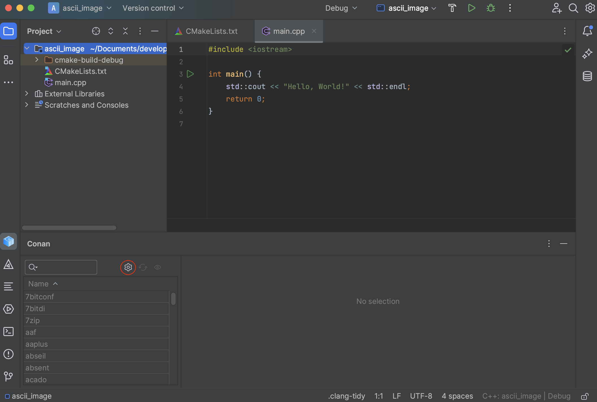
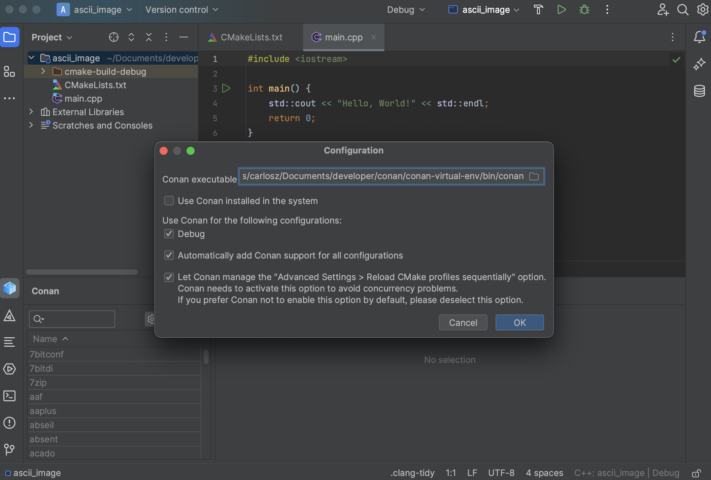
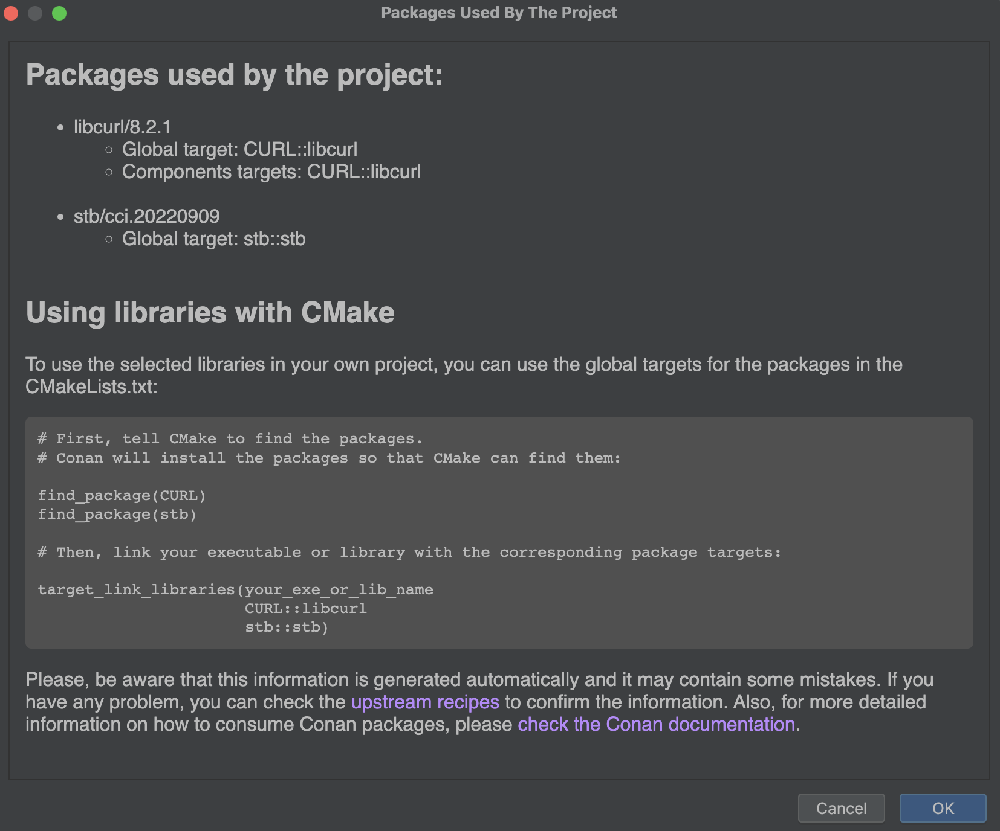

.. _integrations_clion:

|clion_logo| CLion
==================

Introduction
------------

There's a plugin `available in the JetBrains Marketplace
<https://plugins.jetbrains.com/plugin/11956-conan>`_ that's compatible with CLion versions
higher than *2022.3*. With this plugin, you can browse Conan packages available in `Conan
Center <https://conan.io/center>`_, add them to your project, and install them directly
from the CLion IDE interface.

This plugin utilizes `cmake-conan
<https://github.com/conan-io/cmake-conan/tree/develop2>`_, a `CMake dependency provider
<https://cmake.org/cmake/help/latest/guide/using-dependencies/index.html#dependency-providers>`_
for Conan. It injects ``conan_provider.cmake`` using the
``CMAKE_PROJECT_TOP_LEVEL_INCLUDES`` definition. This dependency provider translates the
CMake configuration to Conan. For instance, if you select a *Debug* profile in CLion,
Conan will install and use the packages for *Debug*. 

Bear in mind that *cmake-conan* activates the Conan integration every time CMake calls
``find_package()``. This means that no library will be installed until the CMake configure
step runs. At that point, Conan will attempt to install the required libraries and build
them if necessary. 

Also, note that dependency providers are a relatively new feature in CMake. Therefore, you
will need CMake version >= 3.24 and Conan >= 2.0.5.

Installing the plugin
---------------------

To install the new Conan CLion plugin, navigate to the JetBrains marketplace. Open CLion,
go to *Settings > Plugins*, then select the *Marketplace* tab. Search for the Conan plugin
and click on the Install button. 

|clion_install_plugin|

After restarting CLion, a new “Conan” tool tab will appear at the bottom of the IDE.

Configuring the plugin
----------------------

Open a CMake project or create a new one in CLion. Then, go to the “Conan” tool tab at the
bottom of the IDE. The only enabled action in the toolbar of the plugin will be the one
with the "wheel" (configuration) symbol. Click on it.

|clion_configuration_1|

The first thing you should do is configure the Conan client executable that will be used.
You can point to a specific installation in an arbitrary location on your system, or you
can select "Use Conan installed in the system" to use the system-level installation.

|clion_configuration_2|

Several options are marked as default. Let's review them:

- You'll see checkboxes indicating which configurations Conan should manage. In our case,
  since we only have the Debug configuration, it's the only one checked. Below that,
  "Automatically add Conan support for all configurations" is checked by default. This
  means you don't need to manually add Conan support to new build configurations; the
  plugin will do it automatically.

- There's also a checkbox allowing Conan to modify the default CLion settings and run
  CMake sequentially instead of in parallel. This is necessary because the Conan cache
  isn't concurrent yet in Conan 2. 

If you're using the Conan plugin, you typically wouldn't uncheck these options. After
setting your preferences, click the OK button to finalize the configuration.

**Note:** At this point, CLion will run the configure step for CMake automatically. Since
the plugin sets up the *conan.cmake* dependency provider, a warning will appear in the
CMake output. This warning indicates that we haven't added a `find_package()` to our
*CMakeLists.txt* yet. This warning will disappear once we add the necessary
`find_package()` calls to the *CMakeLists.txt* file. 

After the initial configuration, you'll notice that the list of libraries is enabled. The
"update" and "inspect" buttons are also active. We'll explain these in detail
later.

Using the plugin
----------------

With the plugin configured, you can browse available libraries and install them from
CLion. For example, if you want to use `libcurl <https://curl.se/libcurl/>`_ to download
an image from the Internet, navigate to the library list and search for *libcurl*.
Information on how to add it to CMake will be displayed, along with a "Use in project"
button. Select the version you want and click the button. 

|clion_use_libcurl|

If you click on the "eye" (inspect) icon, you'll see all the libraries added to the project
(assuming you added more than one). This view includes basic target information for CMake
and the necessary code snippets to integrate them into CMake. 

|clion_inspect|

Conan stores information about the used packages in a *conandata.yml* file in your project
folder. This file is read by a *conanfile.py*, which is also created during this process.
You can customize these files for advanced plugin usage, but ensure you read the
information in the corresponding files to do this correctly. Modify your *CMakeLists.txt*
according to the instructions, which should look something like this:

.. code-block:: cmake

   cmake_minimum_required(VERSION 3.15) project(project_name) set(CMAKE_CXX_STANDARD 17)
   find_package(CURL) add_executable(project_name main.cpp)
   target_link_libraries(project_name CURL::libcurl)

After reloading the CMake project, you should see Conan installing the libraries in the
CMake output tab.

.. seealso::

    - For more details, check the `entry in the Conan blog about the plugin
      <https://blog.conan.io/introducing-new-conan-clion-plugin/>`_.

.. |clion_logo| image:: ../images/integrations/clion/conan-icon-clion.png

.. |clion_use_libcurl| image:: ../images/integrations/clion/clion-use-libcurl.png
