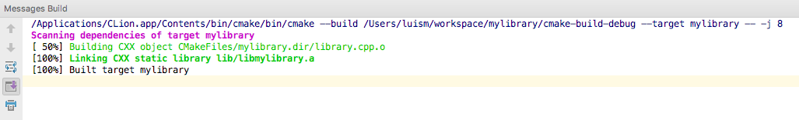
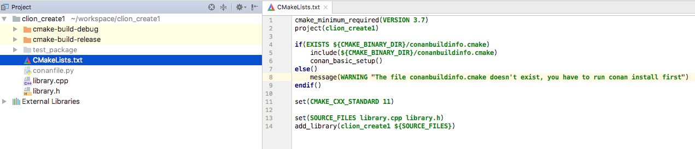
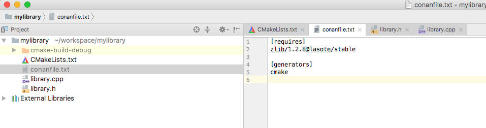
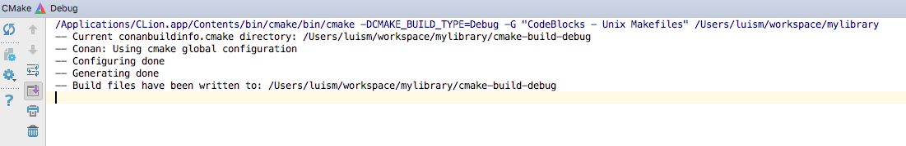
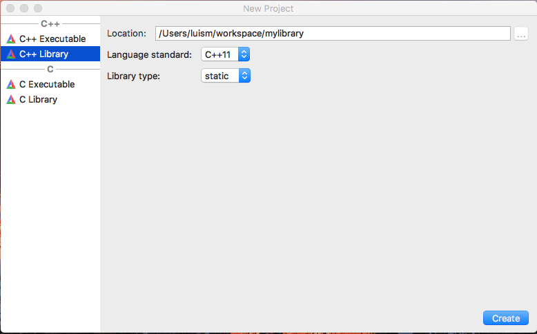

.. _clion:

|clion_logo| CLion
____________________

CLion uses **CMake** as the build system of projects, so you can use the :ref:`CMake generator<cmake>` to manage your requirements in your CLion project.

Just include the ``conanbuildinfo.cmake`` this way:

.. code-block:: cmake

   if(EXISTS ${CMAKE_BINARY_DIR}/conanbuildinfo.cmake)
       include(${CMAKE_BINARY_DIR}/conanbuildinfo.cmake)
       conan_basic_setup()
   else()
       message(WARNING "The file conanbuildinfo.cmake doesn't exist, you have to run conan install first")
   endif()

If the ``conanbuildinfo.cmake`` file is not found, it will print a warning message in the ``Messages`` console of your Clion IDE.

Using packages in a CLion project
=================================

Let see an example of how to use Conan requirements to a CLion project.

1. Create a new CLion project

|wizard_new|

2. Edit the ``CMakeLists.txt`` file and add the following lines:

.. code-block:: cmake

   if(EXISTS ${CMAKE_BINARY_DIR}/conanbuildinfo.cmake)
       include(${CMAKE_BINARY_DIR}/conanbuildinfo.cmake)
       conan_basic_setup()
   else()
       message(WARNING "The file conanbuildinfo.cmake doesn't exist, you have to run conan install first")
   endif()

|cmakelists|

3. CLion will reload your CMake project and you will be able to see a Warning in the console, because the
``conanbuildinfo.cmake`` file still doesn't exists:

|configure_warning_info|

4. Create a ``conanfile.txt`` with all your requirements and use the ``cmake`` generator. In this case we are only
requiring zlib library from a conan package:

.. code-block:: txt

    [requires]
    zlib/1.2.8@lasote/stable

    [generators]
    cmake

|conanfile_txt|

.. _step_five:

5. Now go to your build directory, ``cmake-build-debug`` and execute ``conan install`` to install your requirements and
generate the ``conanbuildinfo.cmake`` file:

.. code-block:: bash

   $ cd cmake-build-debug
   $ conan install ../ -s build_type=Debug

6. Repeat the last step if you have the release build types configured in your CLion IDE, but changing the build_type
setting accordingly:

.. code-block:: bash

   $ cd cmake-build-release
   $ conan install ../ -s build_type=Release

7. Now reconfigure your CLion project, the Warning message is not shown anymore:

|configure_ok|

8. Open the ``library.cpp`` file and include the ``zlib.h``, if you follow the link you can see that CLion automatically
detect the ``zlib.h`` header file from the local conan cache.

|library_cpp|

9. Build your project normally using your CLion IDE:

|built_ok|

You can check a full example of a CLion project reusing conan packages in this github repository: `lasote/clion-conan-consumer <https://github.com/lasote/clion-conan-consumer>`_.

Creating conan packages in a CLion project
==========================================

Now we are going to see how to create a conan package from the previous library.

1. Create a new CLion project

|wizard_new|

2. Edit the ``CMakeLists.txt`` file and add the following lines:

.. code-block:: cmake

   if(EXISTS ${CMAKE_BINARY_DIR}/conanbuildinfo.cmake)
       include(${CMAKE_BINARY_DIR}/conanbuildinfo.cmake)
       conan_basic_setup()
   else()
       message(WARNING "The file conanbuildinfo.cmake doesn't exist, you have to run conan install first")
   endif()

|cmakelists|

3. Create a ``conanfile.py`` file. It's recommended to use the ``conan new`` command.

.. code-block:: bash

   $ conan new mylibrary/1.0@myuser/channel

And edit the file:

- We are removing the ``source`` method because we have the sources in the same project, so we can use the
  ``exports_sources``.

- In the ``package_info`` method adjust the library name, in this case our ``CMakeLists.txt`` is creating a target library called
  ``mylibrary``.

- Adjust the ``copy`` function calls in the ``package`` method to ensure that all your headers and libraries are copied to the conan package.

.. code-block:: python

    from conans import ConanFile, CMake, tools

    class MylibraryConan(ConanFile):
        name = "mylibrary"
        version = "1.0"
        license = "MIT"
        url = "<Package recipe repository url here, for issues about the package>"
        settings = "os", "compiler", "build_type", "arch"
        options = {"shared": [True, False]}
        default_options = "shared=False"
        generators = "cmake"
        requires = "zlib/1.2.8@lasote/stable"
        exports = "*.h", "*.cpp", "CMakeLists.txt"

        def build(self):
            cmake = CMake(self)
            cmake.configure()
            cmake.build()

        def package(self):
            self.copy("*.h", dst="include")
            self.copy("*.lib", dst="lib", keep_path=False)
            self.copy("*.dll", dst="bin", keep_path=False)
            self.copy("*.so", dst="lib", keep_path=False)
            self.copy("*.a", dst="lib", keep_path=False)

        def package_info(self):
            self.cpp_info.libs = ["mylibrary"]

4. To build your library with CLion follow the guide of :ref:`Using packages from the step 5<step_five>`.

5. To package your library use the ``conan package`` command passing the used build folder:

.. code-block:: bash

   $ mkdir package && cd package
   $ conan package ../ --build_folder=../cmake-build-debug

6. If we list the ``package`` folder we can see:

- A ``lib`` folder containing our library
- A ``include`` folder containing our header files
- A ``conaninfo.txt`` and a	``conanmanifest.txt`` conan files.

7. If everything looks good in your ``package`` folder you can export your recipe to your local cache and/or upload it
to a conan server.

.. code-block:: bash

   $ conan export myuser/channel
   $ conan upload mylibrary/1.0@myuser/channel # This will upload only the recipe, use --all to upload all the generated binary packages

8. Instead of the local ``package`` local command, you could use the ``-t`` option in the ``conan new`` and use the
``conan test_package``. Check :ref:`Creating packages getting started guide<packaging_getting_started>`.

You can check a full example of a CLion project for creating a conan package in this github repository: `lasote/clion-conan-package <https://github.com/lasote/clion-conan-package>`_.

.. |clion_logo| image:: ../images/clion/icon_CLion.png

.. |configure_warning_info| image:: ../images/clion/configure_warning_info.png
.. |library_cpp| image:: ../images/clion/library_cpp.png

