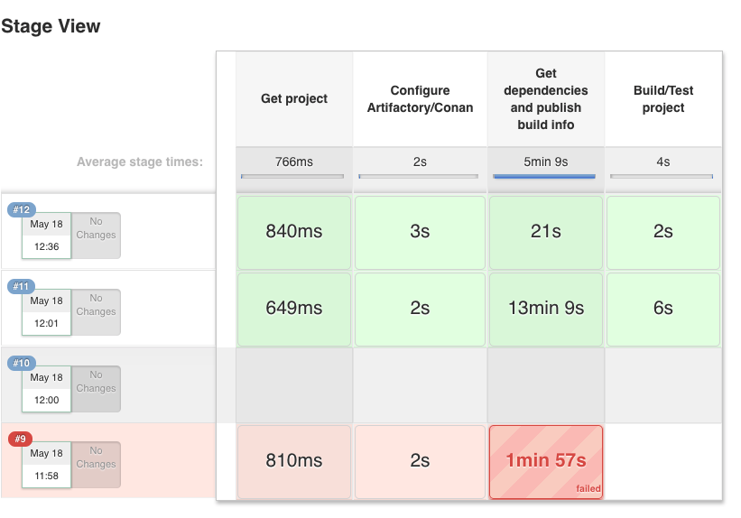
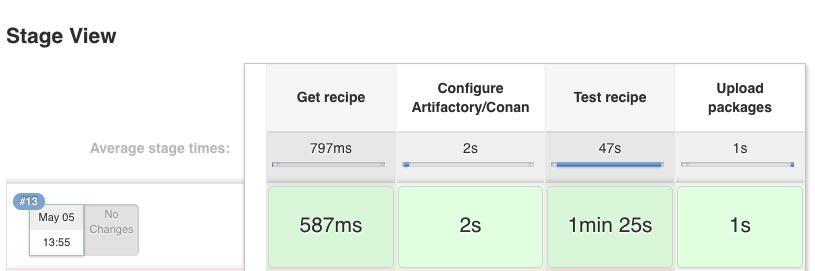

|jenkins_logo| Jenkins
=============================

You can use `Jenkins CI` both for:

- Building and testing your project, which manages dependencies with Conan, and probably a conanfile.txt file
- Building and testing conan binary packages for a given conan package recipe (with a conanfile.py) and uploading to a
  conan remote (Artifactory or conan_server)

There is no need for any special setup for it, just install conan and your build tools in the Jenkins machine and call
the needed ``conan`` commands.

Artifactory and Jenkins integration
___________________________________

If you are using `Artifactory`_ you can take advantage of the `Jenkins Artifactory Plugin`_.
Check `here how to install the plugin`_ and `here you can check the full documentation about the DSL`_.

The Artifactory Jenkins plugin provides a powerful DSL language to call conan, connect with your Artifactory instance,
upload and download your packages from Artifactory and manage your `build information`_.

Example: Test your project getting requirements from Artifactory
****************************************************************

This is a template to use Jenkins with Artifactory plugin and Conan to retrieve your package from Artifactory server
and publish the `build information`_ about the downloaded packages to Artifactory.

In this script we assume that we already have all our dependencies in the Artifactory server, and we are building
our project that uses **Boost** and **Poco** libraries.

Create a new Jenkins Pipeline task using this script:

.. code-block:: groovy

    //Adjust your artifactory instance name/repository and your source code repository
    def artifactory_name = "artifactory"
    def artifactory_repo = "conan-local"
    def repo_url = 'https://github.com/memsharded/example-boost-poco.git'
    def repo_branch = 'master'

    node {
        def server = Artifactory.server artifactory_name
        def client = Artifactory.newConanClient()

        stage("Get project"){
            git branch: repo_branch, url: repo_url
        }

        stage("Get dependencies and publish build info"){
            sh "mkdir -p build"
            dir ('build') {
              def b = client.run(command: "install ..")
              server.publishBuildInfo b
            }
        }

        stage("Build/Test project"){
            dir ('build') {
              sh "cmake ../ && cmake --build ."
            }
        }
    }

|jenkins_stages|

Example: Build a conan package and upload it to Artifactory
***********************************************************

In this example we will call conan :ref:`test package<creating_and_testing_packages>` command to create a binary packages
and then upload it to Artifactory. We also upload the `build information`_:

 
.. code-block:: groovy

    def artifactory_name = "artifactory"
    def artifactory_repo = "conan-local"
    def repo_url = 'https://github.com/lasote/conan-zlib.git'
    def repo_branch = "release/1.2.11"

    node {
        def server = Artifactory.server artifactory_name
        def client = Artifactory.newConanClient()
        def serverName = client.remote.add server: server, repo: artifactory_repo

        stage("Get recipe"){
            git branch: repo_branch, url: repo_url
        }

        stage("Test recipe"){
            client.run(command: "create")
        }

        stage("Upload packages"){
            String command = "upload * --all -r ${serverName} --confirm"
            def b = client.run(command: command)
            server.publishBuildInfo b
        }
    }

|jenkins_stages_creator|

.. _`Artifactory`: https://www.jfrog.com/artifactory/
.. _`Jenkins Artifactory Plugin`:
.. _`here how to install the plugin`: https://www.jfrog.com/confluence/display/RTF/Jenkins+%28Hudson%29+Artifactory+Plug-in
.. _`here you can check the full documentation about the DSL`: https://www.jfrog.com/confluence/display/RTF/Working+With+Pipeline+Jobs+in+Jenkins
.. _`build information`: https://www.jfrog.com/confluence/display/RTF/Build+Integration
