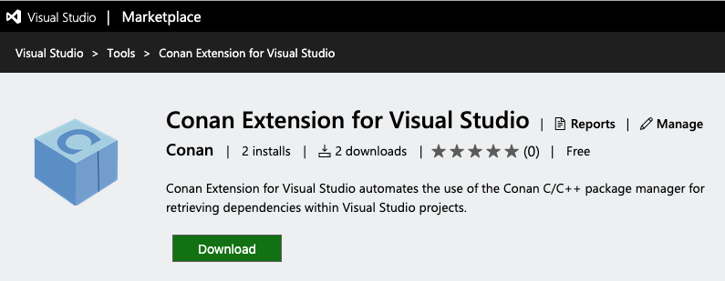

.. _visual_studio:

|visual_logo| Visual Studio
===========================

Microsoft Visual Studio is one of the most used IDEs to develop C++ applications and Conan has
many utilities to work with it. This section serves as a reference to briefly describe some
of them and link to their own sections, but it will also contain documentation related to
some utilities that are totally dedicated to Visual Studio itself.

There are two different ways that can be used to integrate Conan into Visual Studio, always
requiring the generators provided by Conan:

.. toctree::
   :maxdepth: 2

   Using Conan provided CMake generators <visual_studio/cmake_generators>
   Using Conan provided Visual Studio generators <visual_studio/visual_studio_generators>

Conan Extension for Visual Studio
---------------------------------

Thanks to the invaluable help of our community we manage to develop and maintain a free extension
for Visual Studio in the Microsoft Marketplace, it is called Conan Extension for Visual
Studio and provide and integration with Conan using the some of the :ref:`Visual Studio
generators <visualstudio_generator>`.

You can install it into your IDE using the **Extensions manager** and start using it right away,
this extension will look for a *conanfile.txt* in the solution and retrieve the requirements
declared in it that match your build configuration (it will build them from sources too if no
binaries are available).

Read more about this extension in the documentation associated to `its repository`_ and also
in the release notes we publish with major releases in our blog (`May 15th, 2019`_).

.. _`its repository`: https://github.com/conan-io/conan-vs-extension
.. _`May 15th, 2019`: TODO: Link to the blogpost

Build helpers
-------------

Conan provides several build helpers to help the developer to set all the flags and definitions
corresponding to the settings declared in the profile. Targeting Windows builds with Visual
Studio there are two that will be helpful:

- :ref:`msbuild`: it can build and existing Visual Studio solution
- :ref:`visual_studio_build`: provides an easy way to populate a Visual Studio development
  environment to run commands such as ``cl`` or ``ml`` to call the compiler and related tools.

We encourage you to read more about these build helpers in the linked sections.

Toolsets
--------

Conan provides a default :ref:`settings_yml` file with the most common configurations regarding
each operating system, platform and compiler. For the Visual Studio compiler there are two
subsettings that do not appear in other compilers: ``toolset`` and ``runtime``.

The ``toolset`` subsetting will be automatically applied when using the :ref:`CMake <cmake_reference>`
or :ref:`MSBuild <msbuild>` build helpers, although you can override those values using the
``toolset`` parameter exposed in their interfaces.

Regarding the ``toolset`` too, Conan by default won't generate a new binary package if the
specified ``compiler.toolset`` matches the default value for the corresponding ``compiler.version``.
Nevertheless you can change this behavior in the ``package_id()`` method of your recipe using
the pair of functions ``vs_toolset_compatible`` and ``vs_toolset_incompatible`` as they are
documented in the :ref:`conanfile reference <method_package_id>`.

.. |visual_logo| image:: ../images/visual-studio-logo.png
                 :width: 100 px
                 :alt: Visual Studio logo
