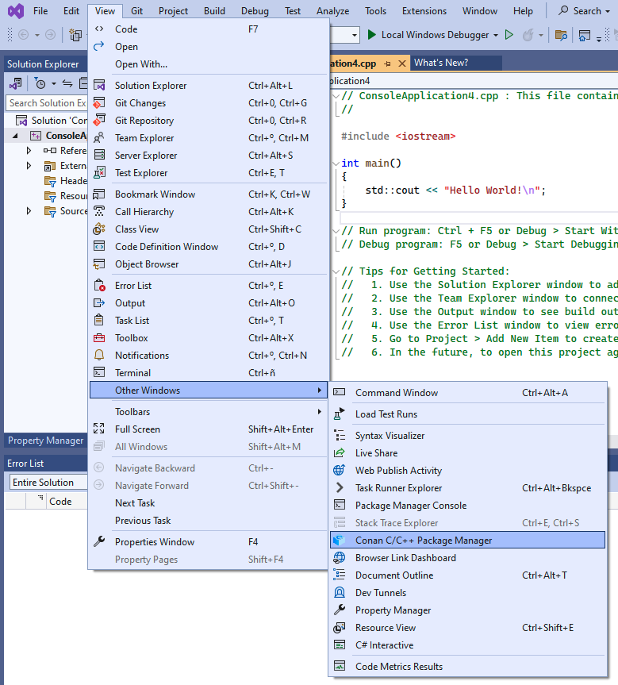
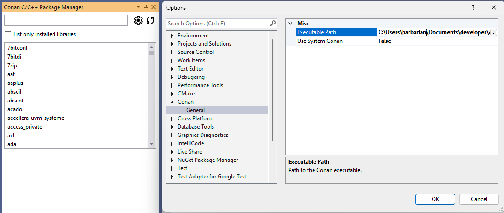
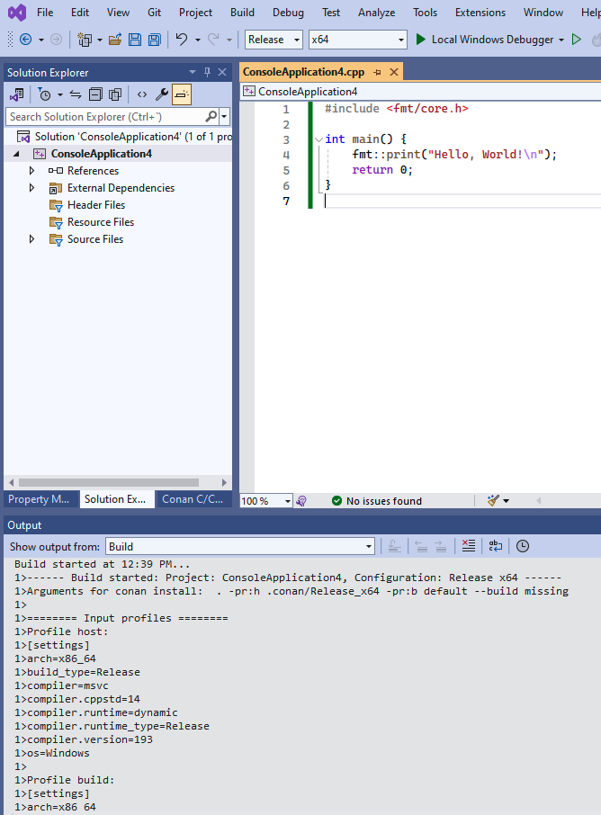

.. _integrations_visual_studio:

|visual_studio_logo| Visual Studio
==================================

Recipe tools for Visual Studio
------------------------------

Conan provides several tools to help manage your projects using Microsoft Visual Studio.
These tools can be imported from ``conan.tools.microsoft`` and allow for native
integration with Microsoft Visual Studio, without the need to use CMake and instead
directly using Visual Studio solutions, projects, and property files. The most relevant
tools are:

- `MSBuildDeps`: the dependency information generator for Microsoft MSBuild build system.
  It will generate multiple ``xxxx.props`` properties files, one per dependency of a
  package, to be used by consumers using MSBuild or Visual Studio, just by adding the
  generated properties files to the solution and projects.

- `MSBuildToolchain`: the toolchain generator for MSBuild. It will generate MSBuild
  properties files that can be added to the Visual Studio solution projects. This
  generator translates the current package configuration, settings, and options, into
  MSBuild properties files syntax.

- `MSBuild` build helper is a wrapper around the command line invocation of MSBuild. It
  will abstract the calls like ``msbuild "MyProject.sln" /p:Configuration=<conf>
  /p:Platform=<platform>`` into Python method calls.

For the full list of tools under ``conan.tools.microsoft`` please check the
:ref:`reference <conan_tools_microsoft>` section.

.. _integrations_visual_studio_extension:

Conan extension for Visual Studio
---------------------------------

There's an extension `available in the VisualStudio Marketplace
<https://marketplace.visualstudio.com/items?itemName=conan-io.conan-vs-extension>`_ that's
compatible begining from Visual Studio  version *2022*. With this extension, you can
browse Conan packages available in `Conan Center <https://conan.io/center>`_, add them to
your project, and they will be automatically installed before building your projects.

.. note::

   The Visual Studio extension is only compatible with C/C++ projects based on MSBuild. It
   will not work with CMake-based projects or projects using other technologies. For
   CMake-based projects, please refer to the `cmake-conan dependency provider
   <https://github.com/conan-io/cmake-conan>`_.

Installation
~~~~~~~~~~~~

The Conan Visual Studio Extension can be installed directly from within Visual Studio:

- Open the Extensions menu.
- Select Manage Extensions.
- Search for "Conan" in the Online marketplace.
- Download and install the extension.

Alternatively, you can download the latest release from our `releases page
<https://github.com/conan-io/conan-vs-extension/releases/latest>`_ and install it
manually.

Initial Configuration
~~~~~~~~~~~~~~~~~~~~~

After installing the Conan extension, you can access it from the “Conan” tool window in
Visual Studio. To do so, go to **View > Other Windows > Conan C/C++ Package Manager**.

Initially, you will need to configure the Conan executable to be used by the extension. By
clicking on the *configure* button (gear icon) from the extension's window, you can set up
the path to the Conan client executable. You can either specify a custom path or choose to
use the Conan client installed at the system level.

Once you have configured the Conan client, the extension is ready to use, and you can
start adding libraries to your project.

Searching and Adding Libraries
~~~~~~~~~~~~~~~~~~~~~~~~~~~~~~

Once configured, the library list in the Conan tool window becomes active, and you can
search for Conan packages using the search bar. Selecting a library will allow you to view
its details, including available versions and integration options.

.. image:: ../images/integrations/vs_extension/search-packages.png
    :alt: Search for Conan packages

If you now click the `Add requirement` button, the extension will add a `conanfile.py` and
a `conandata.yml` to your project with the necessary information to install the selected
Conan packages. It will also add a prebuild event to the project to install those
libraries on the next compilation of the project.

At any point, you can also use the *refresh* button (circular arrow icon) to update the list of available
packages in `Conan Center <https://conan.io/center>`_.

Now, if you initiate the build process for your project, the pre-build event will trigger
Conan to install the packages and inject the necessary properties into the project,
enabling Visual Studio to compile and link against those libraries.

.. warning::

   The initial compilation might fail if Visual Studio does not have sufficient time to
   process the injected properties. If this happens, simply rebuild the project, and it
   should build successfully.

For a more in-depth introduction to the Conan Visual Studio extension with a practical
example, please check this `example in Conan blog
<https://blog.conan.io/2024/03/21/Introducing-new-conan-visual-studio-extension.html>`_. 

.. seealso::

    - Reference for :ref:`MSBuildDeps<conan_tools_microsoft_msbuilddeps>`,
      :ref:`MSBuildToolchain<conan_tools_microsoft_msbuildtoolchain>` and
      :ref:`MSBuild<conan_tools_microsoft_msbuild>`.

    - :ref:`CLion Conan plugin <integrations_clion>`.

.. |visual_studio_logo| image:: ../images/integrations/conan-visual_studio-logo.png
