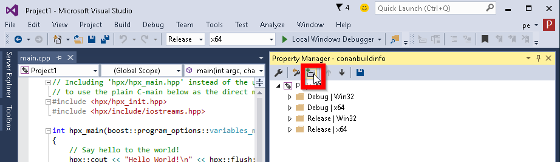

.. _msbuild_integration:

|visual_logo| MSBuild Integration
=================================

If you are using CMake to generate your Visual Studio projects, this is not the right section, go
to (:ref:)`cmake` instead. This section is about native integration with Microsoft MSBuild,
using properties files.

Conan can be integrated with **MSBuild** natively, using the ``conan.tools.microsoft`` tools:
``MSBuildDeps``, ``MSBuildToolchain`` and ``MSBuild`` to generate properties files for your
project, containing information about the project dependencies and toolchain.

With `MSBuildDeps` and `MSBuildToolchain` generators
----------------------------------------------------

Use the **MSBuildDeps** generator if you are maintaining your Visual Studio projects, and want
to use Conan to to tell Visual Studio how to find your third-party dependencies.

Use the **MSBuildToolchain** generator to translate the current package configuration, settings,
and options, into MSBuild properties files syntax that you can add to your Visual Studio project.

Open ``conanfile.txt`` and change (or add) the ``MSBuildDeps`` and ``MSBuildToolchain`` generators:

.. code-block:: text

    [requires]
    poco/1.9.4

    [generators]
    MSBuildDeps
    MSBuildToolchain

Install the requirements:

.. code-block:: bash

    $ conan install .

Go to your Visual Studio project, and open the **Property Manager** (usually in **View -> Other
Windows -> Property Manager**).

.. image:: ../../images/conan-property_manager.png

Click the **+** icon and select the generated ``conandeps.props`` and ``conantoolchain.props`` files:

Build your project as usual.

.. note::

    Remember to set your project's architecture and build type accordingly, explicitly or
    implicitly, when issuing the :command:`conan install` command. If these values don't match,
    your build will probably fail.

    e.g. **Release/x64**

.. seealso::

    Check :ref:`conan_tools_microsoft` for the complete reference.

.. _building_visual_project:

Build an existing Visual Studio project
---------------------------------------

You can build an existing Visual Studio from your ``build()`` method using the
(:ref:)`MSBuild()<msbuild>` build helper.

.. code-block:: python

    from conans import ConanFile
    from conan.tools.microsoft import MSBuild

    class ExampleConan(ConanFile):
        ...

        def build(self):
            msbuild = MSBuild(self)
            msbuild.build("MyProject.sln")

.. seealso::

    Check the (:ref:)`CMake()<cmake_reference>` reference section for more info.

.. |visual_logo| image:: ../../images/conan-visual-studio-logo.png
.. _`Visual Studio project properties`: https://docs.microsoft.com/en-us/visualstudio/ide/managing-project-and-solution-properties?view=vs-2017
