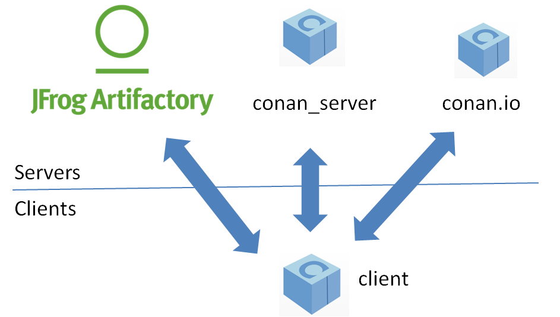

.. _introduction:

Introduction
===============
Open Source
------------
Conan is OSS, with MIT license. Check the source code, issue tracking (for reporting bugs, feature requests) at https://github.com/conan-io/conan

Decentralized package manager
-------------------------------
Conan is a decentralized package manager with a client-server architecture. This mean that clients can fetch packages from different servers (“remotes”), as well as upload them to different servers. Something similar like “git” push-pull model to different remotes.

On a high level, the servers are just package storage. They do not build, or create the packages. The packages are created from the client, and if binaries are built from sources, that compilation is also done from the client application.

The different applications in the picture are:

- The **conan client**: this is a console/terminal command line application, containing the heavy logic for package creation and consumption. Conan client has a local cache for package storage, so it allows to fully create and test packages offline, as well as **working offline** as long as no new packages are needed from remote servers. 
- The **conan_server**: this is a server that can be easily run in your **own server on-premises** to host your private packages. It is also a service application that can be run as a daemon or service, behind a web server (apache, nginx), or easily as stand-alone application.  Both the conan client and the conan_server are OSS, MIT license, so you can use them for free in your company, customize them, redistribute them without any legal issue.
- JFrog `Artifactory <https://www.jfrog.com/artifactory/>`_ offers conan repositories, so it can also be used as an on-premises server. It is a more powerful solution, featuring a WebUI, multiple auth protocols, High Availability, etc. It also has cloud offers that will allow having private packages without having any on-premises infrastructure
- **Conan.io**: Is a public and free hosting service for conan packages. It is not moderated, so anyone could create and upload their own packages, just taking into account that those packages will be public, so they must conform to the respective licenses, specially if packaging third party code. Reading packages from this server doesn’t require an account, that is only required for uploading packages.

Binary management
-------------------------------
One of the powerful features of conan is that it can manage pre-compiled binaries for packages. To define a package, referenced by its name, version, user and channel, a package recipe is needed. Such a package recipe is a conanfile.py python script that defines how the package is built from sources, what are the final binary artifacts, the package dependencies, etc.

.. image:: images/binary_mgmt.png
   :height: 200 px
   :width: 400 px
   :align: center

When a package recipe is used in a conan client and a “package binary” is built from sources, such package binary will be compatible with some certain settings, like the OS it was created for, the compiler and compiler version or the architecture. If the package is built from sources again with different settings, (e.g. for a different architecture) a new, different binary will be generated. By the way, “package binary” is quoted because strictly, it is not necessarily a binary. A header-only library will contain just the headers in the “package binary”.

All the package binaries generated from a package recipe are managed and stored coherently, when they are uploaded to a remote, they keep connected. Also, different clients building binaries from the same package recipe (like CI build slaves in different operating systems), will upload their binaries under the same package name to the remotes.

Consumers, i.e. client application users that are installing existing packages for reuse in their projects, will typically retrieve pre-compiled binaries for their systems if there exist such compatible binaries, or otherwise require building from sources in the client machine to create a package binary matching their settings.

Cross platform, build system agnostic
--------------------------------------

Conan works and is being actively used in Windows, Linux (Ubuntu, Debian, RedHat, ArchLinux, Raspbian), OSX, FreeBSD, SunOS, and as it is portable, it might work in any other platform that can run python. Along the documentation, examples for a specific OS might be found, like ``conan install -s compiler="Visual Studio"``, which will be specific for Windows users, and if in a different system, the reader should adapt to their own platform and settings (like ``conan install -s compiler=gcc``, for example).

Also **conan works with any build system**. Along the documentation CMake will be widely used, because it is portable and well known. But conan does not depend on CMake at all, it is not a requirement. **Conan is totally orthogonal to the build system**. There are some utilities that improve the usage of popular build systems like CMake or Autotools, but they are just helpers. Furthermore, it is not necessary that all the packages are built with the same build system. It is possible to depend on packages created with other build system than the one you are using to build your project.

Got any doubts? Please check out our :ref:`FAQ section <faq>` or |write_us|.

.. |write_us| raw:: html

   <a href="mailto:info@conan.io" target="_blank">write to us</a>
