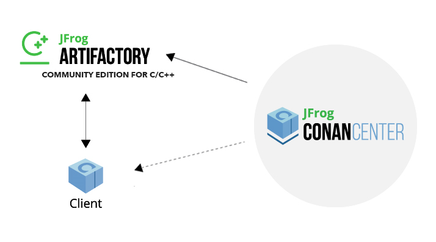

.. _introduction:

Introduction
============

Conan is a dependency and package manager for C and C++ languages. It is `free and open-source <https://github.com/conan-io/conan>`_, works in all platforms ( Windows, Linux, OSX, FreeBSD, Solaris, etc.), and can be used to develop for all targets including embedded, mobile (iOS, Android), and bare metal. It also integrates with all build systems like CMake, Visual Studio (MSBuild), Makefiles, SCons, etc., including proprietary ones.

It is specifically designed and optimized for accelerating the development and Continuous Integration of C and C++ projects. With full binary management, it can create and reuse any number of different binaries (for different configurations like architectures, compiler versions, etc.) for any number of different versions of a package, using exactly the same process in all platforms. As it is decentralized, it is easy to run your own server to host your own packages and binaries privately, without needing to share them. The free `JFrog Artifactory Community Edition (CE) <https://conan.io/downloads.html>`_ is the recommended Conan server to host your own packages privately under your control.

Conan is mature and stable, with a strong commitment to forward compatibility (non-breaking policy), and has a complete team dedicated full time to its improvement and support. It is backed and used by a great community, from open source contributors and package creators in `ConanCenter <https://conan.io/center>`_ to thousands of teams and companies using it.

Open Source
-----------

Conan is Free and Open Source, with a permissive MIT license. Check out the source code and issue tracking (for questions and support, reporting bugs and suggesting feature requests and improvements) at https://github.com/conan-io/conan

Decentralized package manager
-----------------------------

Conan is a decentralized package manager with a client-server architecture. This means that clients can fetch packages from, as well as upload packages to, different servers (“remotes”), similar to the “git” push-pull model to/from git remotes.

At a high level, the servers are just storing packages. They do not build nor create the packages. The packages are created by the client, and if binaries are built from sources, that compilation is also done by the client application.

The different applications in the image above are:

- The Conan client: this is a console/terminal command-line application, containing the heavy logic for package creation and consumption. Conan client has a local cache for package storage, and so it allows you to fully create and test packages offline. You can also work offline as long as no new packages are needed from remote servers.
- `JFrog Artifactory Community Edition (CE) <https://conan.io/downloads.html>`_ is the recommended Conan server to host your own packages privately under your control. It is a free community edition of JFrog Artifactory for Conan packages, including a WebUI, multiple auth protocols (LDAP), Virtual and Remote repositories to create advanced topologies, a Rest API, and generic repositories to host any artifact.
- The conan_server is a small server distributed together with the Conan client. It is a simple open-source implementation and provides basic functionality, but no WebUI or other advanced features.
- `ConanCenter <https://conan.io/center>`_ is a central public repository where the community contributes packages for popular open-source libraries like Boost, Zlib, OpenSSL, Poco, etc.

Binary management
-----------------

One of the most powerful features of Conan is that it can create and manage pre-compiled binaries for any possible platform and configuration. By using pre-compiled binaries and avoiding repeated builds from source, it saves significant time for developers and Continuous Integration servers, while also improving the reproducibility and traceability of artifacts.

A package is defined by a "conanfile.py". This is a file that defines the package's dependencies, sources, how to build the binaries from sources, etc. One package “conanfile.py” recipe can generate any arbitrary number of binaries, one for each different platform and configuration: operating system, architecture, compiler, build type, etc. These binaries can be created and uploaded to a server with the same commands in all platforms, having a single source of truth for all packages and not requiring a different solution for every different operating system.

.. image:: images/conan-binary_mgmt.png
   :width: 70%
   :align: center

Installation of packages from servers is also very efficient. Only the necessary binaries for the current platform and configuration are downloaded, not all of them. If the compatible binary is not available, the package can be built from sources in the client too.

All platforms, all build systems and compilers
----------------------------------------------

Conan works on Windows, Linux (Ubuntu, Debian, RedHat, ArchLinux, Raspbian), OSX, FreeBSD, and SunOS, and, as it is portable, it might work in any other platform that can run 
Python. It can target any existing platform: ranging from bare metal to desktop, mobile, embedded, servers, and cross-building.

Conan works with any build system too. There are built-in integrations to support the most popular ones like CMake, Visual Studio (MSBuild), Autotools and Makefiles, Meson, SCons, etc., but it is not a requirement to use any of them. It is not even necessary that all packages use the same build system: each package can use their own build system, and depend on other packages using different build systems. It is also possible to integrate with any build system, including proprietary ones.

Likewise, Conan can manage any compiler and any version. There are default definitions for the most popular ones: gcc, cl.exe, clang, apple-clang, intel, with different configurations of versions, runtimes, C++ standard library, etc. This model is also extensible to any custom configuration.

.. _stability:

Stable
------

From Conan 2.0 and onwards, there is a commitment to stability, with the goal of not breaking user space while evolving the tool and the platform. This means:

- Moving forward to following minor versions 2.1, 2.2, …, 2.X should never break existing recipes, packages or command line flows
- If something is breaking, it will be considered a regression and reverted.
- Bug fixes will not be considered breaking, recipes and packages relying on the incorrect behavior of such bugs will be considered already broken.
- Only documented features in https://docs.conan.io are considered part of the public interface of Conan. Private implementation details, and everything not included in the documentation is subject to change.
- The compatibility is always considered forward. New APIs, tools, methods, helpers can be added in following 2.X versions. Recipes and packages created with these features will be backwards incompatible with earlier Conan versions.
- Only the latest released patch (major.minor.patch) of every minor version is supported and stable.

There are some things that are not included in this commitment:

- Public repositories, like **ConanCenter**, assume the use of the latest version of the Conan client, and using an older version may result in failure of packages and recipes created with a newer version of the client. It is recommended to use your own private repository to store your own copy of the packages for production, or as a secondary alternative, to use some locking mechanism to avoid possible disruption from packages in ConanCenter that are updated and require latest Conan version.
- Configuration and automatic tools detection, like the detection of the default profile (``conan profile detect``) can and will change at any time. Users are encouraged to define their configurations in their own profiles files for repeatability. New versions of Conan might detect different default profiles.
- Builtin default implementation of extension points as plugins or hooks can also change with every release. Users can provide their own ones for stability.
- Output of packages templates with ``conan new`` can update at any time to use latest features.
- The output streams stdout, stderr, i.e. the terminal output can change at any time. Do not parse the terminal output for automation.
- Anything that is explicitly labeled as ``experimental`` or ``preview`` in the documentation, or in the Conan cli output. Read the section below for a detailed definition of these labels.
- Anything that is labeled as ``deprecated`` in the documentation should not get new usages, as it will not get new fixes and it will be removed in the next major version.
- Other tools and repositories outside of the Conan client

Conan needs Python>=3.6 to run. Conan will deprecate support for Python versions 1 year after those versions have been declared End Of Life (EOL).

If you have any question regarding Conan updates, stability, or any clarification about this definition of stability, please report in the documentation issue tracker: https://github.com/conan-io/docs.

Community
---------

Conan is being used in production by thousands of companies like TomTom, Audi, RTI, Continental, Plex, Electrolux and Mercedes-Benz and many thousands of developers around the world. 

But an essential part of Conan is that many of those users will contribute back, creating an amazing and helpful community:

- The https://github.com/conan-io/conan project has around 6.5K stars in Github and counts with contributions from more than 300 different users (this is just the client tool).
- Many other users contribute recipes for ConanCenter via the https://github.com/conan-io/conan-center-index repo, creating packages for popular Open Source libraries, contributing many thousands of Pull Requests per year.
- More than two thousands Conan users hang around the `CppLang Slack #conan channel <https://cppalliance.org/slack/>`_, and help responding to questions, discussing problems and approaches, making it one of the most active channels in the whole CppLang slack.
- There is a Conan channel in `#include<cpp> discord <https://www.includecpp.org/discord/>`_.

Navigating the documentation
------------------------------

This documentation has very different sections:

- The **tutorial** is an actual hands-on tutorial, with examples and real code, intended to be played sequentially from beginning to end,
  running the exercises in your own computer. There is a "narrative" to this section and the exercises might depend on some previous explanations and code - building on the previous example.
  This is the recommended approach for learning Conan.
- The **examples** also contain hands-on, fully operational examples with code, aimed to explain some very specific feature, tool or behavior.
  They do not have a conducting thread, they should be navigated by topic.
- The **reference** is the source of truth for the interfaces of every public command, class, method, helper, API and configuration file that can
  be used. It is not designed to be read fully, but to check for individual items when necessary.
- The **knowledge** base contains things like the FAQ, a very important section about general guidelines, good practices and bad practices, videos
  from conference talks, etc.

Features in this documentation might be labeled as:

- **experimental**: This feature is released and can be used, but it is under active development and the interfaces, APIs or behavior might change
  as a result of evolution, and this will not be considered breaking. If you are interested in these features you are encouraged to try them
  and give feedback, because that is exactly what allows to stabilize them.
- **preview**: When a feature is released in preview mode, this means it aims to be as final and stable as possible. Users are encouraged to use them,
  and the maintainers team will try not to break them unless necessary. But if necessary, they might change and break.
- **deprecated**: This feature should no longer be used, and it will be fully removed in next major release. Other alternatives or approaches should
  be used instead of it, and if using it, migrating to the other alternatives should be done as soon as possible. They will not be maintained or
  get fixes.

Everything else that is not labeled should be considered stable, and won't be broken, unless something that
is declared a bugfix.

Have any questions? Please check out our :ref:`FAQ section <faq>` or |write_us|.

.. |write_us| raw:: html

   <a href="mailto:info@conan.io" target="_blank">write to us</a>
