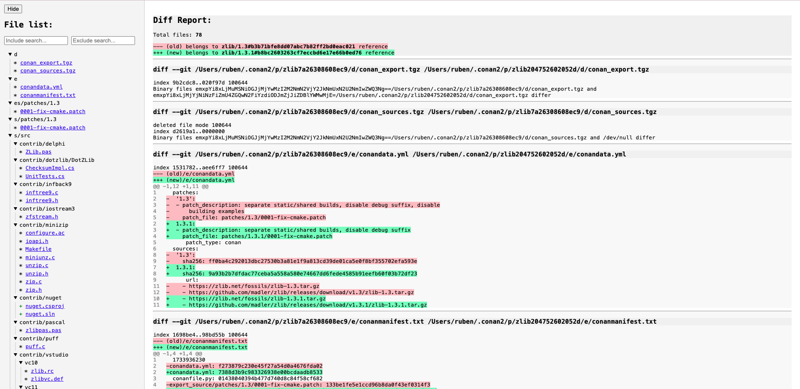

.. _reference_commands_report_diff:

conan report diff
=================

.. autocommand::
    :command: conan report diff -h

The ``conan report diff`` command gets the differences between two recipes, also comparing their sources.
This functionality allows you to compare either two versions of the same recipe or two entirely different recipes.
Each recipe (old and new) can be identified in one of two ways: by providing both the path to its ``conanfile.py`` and
its reference, or by specifying just the reference.

When only a reference is given, Conan will first search for the recipe in the local cache; if it is not found, it will
attempt to download it from the configured remotes. If no revision is explicitly provided, Conan will
default to using the latest available revision.

**Examples**

If we want to compare versions 1.0 and 2.0 of "mylibrary" that are available on our remotes, it would be:

.. code-block:: bash

    $ conan report diff --old-reference="mylib/1.0" --new-reference="mylib/2.0"

This is how it would look if one of the versions is on the remote and the other is not. The version that is not on the
remote requires the path to the recipe in order to compare it.

.. code-block:: bash

    $ conan report diff -or="mylib/1.0" --old-path="path/to/recipe" -nr="mylib/2.0"
    $ conan report diff -or="mylib/1.0" -nr="mylib/2.0" --new-path="path/to/recipe"
    $ conan report diff -or="mylib/1.0" --old-path="path/to/recipe" -nr="mylib/2.0" --new-path="path/to/recipe"

The command allows you to specify the revision of the package you want to compare. By default, it uses the latest
revision, but by providing a revision, you can target the exact package you want to compare. This makes it possible
to do things like compare two identical versions with different revisions in order to check for differences between
them.

.. code-block:: bash

    $ conan compare -or="mylib/1.0#oldrev" -nr="mylib/1.0#newrev"

Available formatters
--------------------

Text Formatter
^^^^^^^^^^^^^^

By default, it displays this format, which is the format provided by a ``git diff`` between the packages.

JSON Formatter
^^^^^^^^^^^^^^

You can obtain the result in JSON format, providing a structured output that is perfect for consumption by other
scripts.

.. code-block:: bash

    $ conan report diff -or="mylib/1.0" -nr="mylib/2.0" --format=json

HTML Formatter
^^^^^^^^^^^^^^

The HTML format generates a small self-contained static web page in a single HTML file. This page lets you conveniently
visualize the changes in the recipe as well as the changes in the source files of your libraries. It contains filters
to include and exclude keywords and shortcuts to all the changed files.

.. code-block:: bash

    $ conan report diff -or="zlib/1.3" -nr="mylib/1.3.1" --format=html

