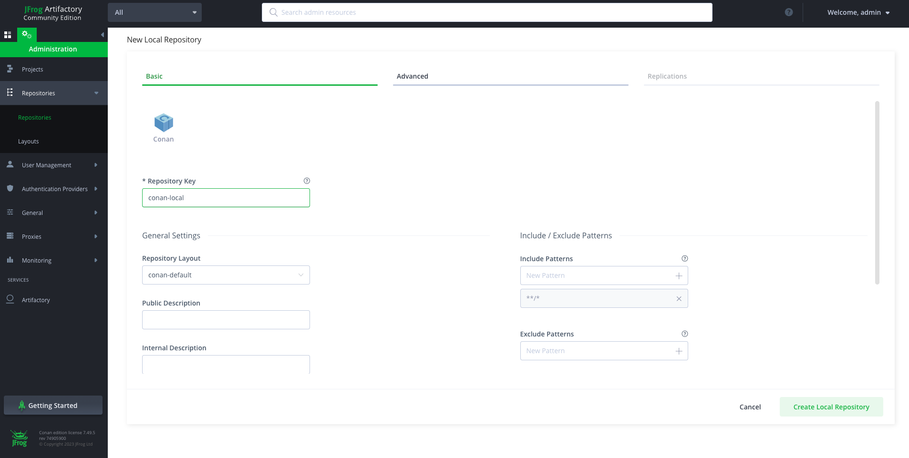

.. _artifactory_ce_cpp:

Artifactory Community Edition for C/C++
=======================================

Artifactory Community Edition (CE) for C/C++ is the recommended server for development and
hosting private packages for a team or company. It is completely free, and it features a
WebUI, advanced authentication and permissions, great performance and scalability, a REST
API, a generic CLI tool and generic repositories to host any kind of source or binary
artifact.

This is a very brief introduction to Artifactory CE. For the complete Artifactory CE
documentation, visit `Artifactory docs <https://jfrog.com/help/>`_.

Running Artifactory CE
----------------------

There are several ways to run Artifactory CE:

Running from a Docker image
^^^^^^^^^^^^^^^^^^^^^^^^^^^

As of Artifactory 7.77, it is mandatory to use an additional SQL database such as
PostgreSQL, or configure the ``allowNonPostgresql: true`` flag in the ``system.yaml`` file
if you wish to use Derby or another database. You can pass that information via
environment variables directly in the command line:

1. **Using Derby** (with the flag ``allowNonPostgresql: true``):

.. code-block:: bash

    $ docker run --name artifactory -d -e JF_SHARED_DATABASE_TYPE=derby -e JF_SHARED_DATABASE_ALLOWNONPOSTGRESQL=true -p 8081:8081 -p 8082:8082 releases-docker.jfrog.io/jfrog/artifactory-cpp-ce:7.90.10

2. **Launching PostgreSQL along with Artifactory**

.. code-block:: bash

    $ docker run --name postgres -itd -e POSTGRES_USER=artifactory -e POSTGRES_PASSWORD=password -e POSTGRES_DB=artifactorydb -p 5432:5432 library/postgres

    $ docker run --name artifactory -d -e JF_SHARED_DATABASE_USERNAME=artifactory -e JF_SHARED_DATABASE_PASSWORD=password -e JF_SHARED_DATABASE_URL=jdbc:postgresql://host.docker.internal:5432/artifactorydb -e JF_SHARED_DATABASE_TYPE=postgresql -e JF_SHARED_DATABASE_DRIVER=org.postgresql.Driver -p 8081:8081 -p 8082:8082 releases-docker.jfrog.io/jfrog/artifactory-cpp-ce:7.90.10

Once Artifactory is up and running, access the web UI by navigating to the default URL
`http://localhost:8082 <http://localhost:8082>`_. The default credentials are
``admin:password``.

For more detailed information, refer to the `official JFrog documentation
<https://jfrog.com/help/r/jfrog-installation-setup-documentation/install-artifactory-single-node-with-docker>`_.

Download and run from a zip file
^^^^^^^^^^^^^^^^^^^^^^^^^^^^^^^^

For instructions on installing Artifactory CE on different operating systems, consult the
relevant JFrog installation documentation:

- `Linux Installation
  <https://jfrog.com/help/r/jfrog-installation-setup-documentation/install-artifactory-single-node-with-linux-archive>`_. `Download link for Linux <https://releases.jfrog.io/artifactory/bintray-artifactory/org/artifactory/cpp/ce/jfrog-artifactory-cpp-ce/[RELEASE]/jfrog-artifactory-cpp-ce-[RELEASE]-linux.tar.gz>`_

- `Windows Installation
  <https://jfrog.com/help/r/jfrog-installation-setup-documentation/install-artifactory-single-node-on-windows>`_. `Download link for Windows <https://releases.jfrog.io/artifactory/bintray-artifactory/org/artifactory/cpp/ce/jfrog-artifactory-cpp-ce/[RELEASE]/jfrog-artifactory-cpp-ce-[RELEASE]-windows.zip>`_

- `MacOS Installation
  <https://jfrog.com/help/r/jfrog-installation-setup-documentation/install-artifactory-single-node-on-mac-darwin>`_. `Download link dor MacOS <https://releases.jfrog.io/artifactory/bintray-artifactory/org/artifactory/cpp/ce/jfrog-artifactory-cpp-ce/[RELEASE]/jfrog-artifactory-cpp-ce-[RELEASE]-darwin.tar.gz>`_

Once Artifactory is up and running, access the web UI by navigating to the default URL
`http://localhost:8082 <http://localhost:8082>`_. The default credentials are
``admin:password``.

Creating and Using a Conan Repo
-------------------------------

Navigate to Administration -> Repositories -> Repositories, then click on the "Add
Repositories" button and select "Local Repository". A dialog for selecting the package
type will appear, select **Conan**, then type a "Repository Key" (the name of the
repository you are about to create), for example "conan-local" and click on "Create Local
Repository". You can create multiple repositories to serve different flows, teams, or
projects.

Now, let's configure the Conan client to connect with the "conan-local" repository. First
add the remote to the Conan remote registry:

.. code-block:: bash

    $ conan remote add artifactory http://localhost:8081/artifactory/api/conan/conan-local

Then configure the credentials for the remote:

.. code-block:: bash

    $ conan remote login artifactory <user> -p <password>

From now, you can upload, download, search, etc. the remote repos similarly to the other
repo types.

.. code-block:: bash

    $ conan upload <package_name> -r=artifactory
    $ conan search "*" -r=artifactory
