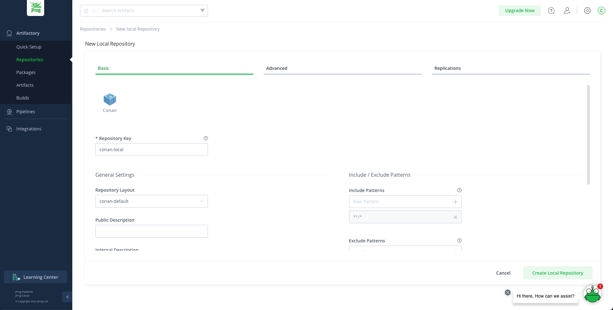

.. _artifactory_free_tier:

Artifactory free-tier
=====================

Conan packages can be uploaded to Artifactory under your own users or organizations. To create a
repository follow these steps:

1. **Create an Artifactory Free-Tier account**

   Browse to https://jfrog.com/community/start-free/ and submit the form to create your account. Note that
   you don't have to use the same username that you use for your Conan account.

   .. image:: ../../../../images/artifactory/free_tier_create_account.png

2. **Create a Conan repository**

Navigate to Artifactory -> Repositories, then click on the "Create a Repository" button
and select "Local Repository". A dialog for selecting the package type will appear, select
**Conan**, then type a "Repository Key" (the name of the repository you are about to
create), for example "conan-local" and click on "Create Local Repository". You can create
multiple repositories to serve different flows, teams, or projects.

3. **Configure the repository in the Conan client**

   To get the correct address, click on ``Artifactory -> Artifacts``, select the
   conan-local repository we have just created and click on the "Set Me Up" button:

   .. image:: ../../../../images/artifactory/free_tier_setme_up.png

   Add a Conan remote in your Conan client pointing to your Artifactory repository.

   .. code-block:: bash

       $ conan remote add <remote_name> <remote_url>

4. **Get your API key**

   Your API key is the “password” used to authenticate the Conan client to Artifactory,
   NOT your Artifatory password. To get your API key, go to “Platform configuration” on
   the top right corner and the "User Management -> Access Tokens" and click on "Generate
   token" to create a new token.
   
   .. image:: ../../../../images/artifactory/free_tier_token.png

5. **Set your user credentials**

   Add your Conan user with the API Key, your remote and your Artifatory user name:

   .. code-block:: bash

        $ conan remote login <remote> <user> -p <api_key>

Setting the remotes in this way will cause your Conan client to resolve packages and
install them from repositories in the following order of priority:

  1. `conancenter`_
  2. Your own repository

If you want to have your own repository first, you can update the position in the Conan
remote registry:

.. code-block:: bash

    $ conan remote update <your_remote> --index 0
    $ conan remote list
      <your remote>: <your_url> [Verify SSL: True, Enabled: True]
      conancenter: https://center.conan.io [Verify SSL: True, Enabled: True]

.. tip::

    Check the full reference of the :ref:`conan remote<reference_commands_remote>` command.

.. _`conancenter`: https://conan.io/center
