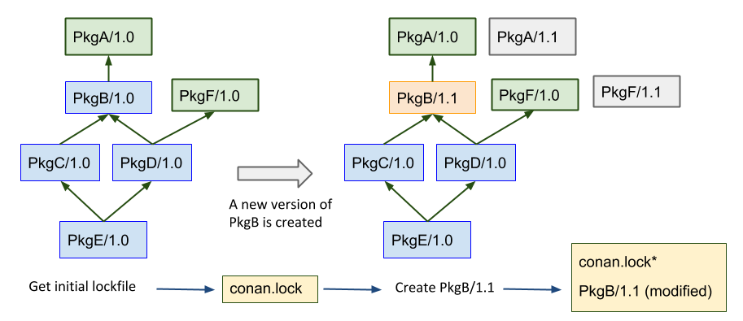
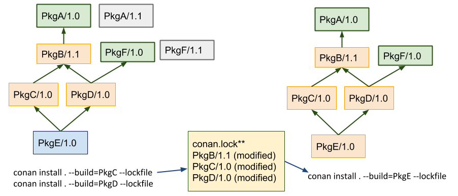

.. _versioning_lockfiles:

Lockfiles
=========

.. warning::

    This is an **experimental** feature subject to breaking changes in future releases.

Lockfiles are files that store the information of a dependency graph, including the
exact versions, revisions, options, and configuration of that dependency graph. As 
they depend on the configuration, and the dependency graph can change with every 
different configuration, there will be one lockfile for every configuration.

Lockfiles are useful for achieving deterministic builds, even if the dependency 
definitions in conanfile recipes are not fully deterministic, for example when using
version ranges or using package revisions.

Let's say we have 3 package recipes PkgC, PkgB, and PkgA, that define this dependency graph:

.. image:: ../images/graph_not_deterministic.png

The first time, when a :command:`conan install .` is executed, the requirement defined
in PkgB is resolved to **PkgA/1.0**, because that was the latest at that time that
satisfied the version range ``PkgA/[*]``. After such install, the user can build and 
run an application in the source code of PkgC. But some time later, another colleague
tries to do exactly the same, and suddenly it is pulling a newer version of PkgA that
was recently published, getting different results (maybe even not working). Builds with
version ranges are not reproducible by default.

Using lockfiles
---------------
Lockfiles solve this problem creating a file that stores this information. In the example
above, the first :command:`conan install .` will generate a *conan.lock* file that can be
used later:

.. code-block:: bash

    $ cd PkgC
    $ conan install .  # generates conan.lock
    # After PkgA/1.1 has been created
    $ conan install . --lockfile # uses the existing conan.lock

The second time that :command:`conan install . --lockfile` is called, with the lockfile argument
it will load the previously generated *conan.lock* file, that contains the information that
**PkgA/1.0** is used, and will apply it again to the dependency resolution, resolving exactly
the same dependency graph:

.. image:: ../images/graph_locked.png

The *conan.lock* file contains more information than the versions of the dependencies, it contains:

- The "effective" profile that has been used to compute this lockfile. The effective profile is the
  combination of the profile files that could have been passed in the command line, pluse any
  other settings or options directly defined in the command line.
- It encodes a graph, not just a list of versions, as different nodes in the graph might be using
  different versions too.
- The options values at each package. As downstream consumers can define options values, it is
  important that this information is also stored, so it is also possible to build intermediate nodes
  of the graph leading to the same result.
- Another kind of requirements like python_requires.

Again, it is important to remember that every different configuration will generate a different
graph, and then a different *conan.lock* as result. So the example above would be more like the
following if we wanted to work with different configurations (e.g. Debug/Release):

.. code-block:: bash

    $ cd PkgC
    $ cd release
    $ conan install .. # generates conan.lock (release) in this folder
    $ cd ../debug
    $ conan install .. -s build_type=Debug # generates conan.lock (debug) 
    # After PkgA/1.1 has been created
    $ conan install .. --lockfile # uses the existing conan.lock (debug)
    $ cd ../release
    $ conan install .. --lockfile # uses the existing conan.lock (release)

Commands
--------

There are 2 main entry points for lockfile information in conan commands:

- :command:`--lockfile` argument in :command:`install/create/export/info`

    If the command builds a package, it can modify its reference. Even if the version is not changed,
    if something in the recipe changes, it will get a new recipe revision RREV and if the package is
    built from sources again, it might end with a new, different package revision PREV. Those changes
    will be updated in the *conan.lock* lockfile, and the package will be marked as "modified".

- :command:`conan graph` command

    This command group contains several functions related to the management of lockfiles:

    - :command:`conan graph lock`

        This command will generate a *conan.lock* file. It behaves like :command:`conan install` command,
        (this will also generate a lockfile by default), but without needing to actually install the
        binaries, so it will be faster. In that regard, it is equal to :command:`conan info` that can also
        generate a lockfile, but the problem with :command:`conan info -if=.` is that it does not allow to 
        specify a profile or settings.

    - :command:`conan graph clean-modified`

        When a :command:`conan create` command that uses a lockfile builds a new binary, its reference
        will change. This change, typically in the form of a recipe revision and/or package revision
        is updated in the lockfile and the node is marked as "modified". This :command:`clean-modified`
        removes these "modified" flags from a lockfile. This operation is typically needed before starting
        the build of a package in a locked graph, to know exactly which nodes have been modified by this
        operation.

    - :command:`conan graph update-lock`

        Update the current lockfile with the information of the second lockfile. Only the nodes marked
        as "modified" will be updated. Trying to update to the current lockfile one node that has already
        been "modified" will result in an error.

    - :command:`conan graph build-order`

        Takes a lockfile as an argument, and return a list of lists indicating the order in which packages
        in the graph have to be built. It only returns those packages that really need to be built,
        following the :command:`--build` arguments and the ``package_id()`` rules.

For more information see :ref:`commands`

How to use lockfiles in CI
--------------------------

One of the applications of lockfiles is to be able to propagate changes done in one package
belonging to a dependency graph downstream its affected consumers.

Let's say that we have the following scenario in which one developer does some changes to PkgB,
creating a new version **PkgB/1.1**, and lets assume that all packages use version-ranges.
The goal is to be able to build a new dependency graph down to **PkgE/1.0** in which only those
changes done in **PkgB/1.1** are taken into account but not other new versions of other packages,
like new versions of PkgA and PkgF.

The process can begin capturing a lockfile of the initial status of our "product", down to PkgE:

.. code-block:: bash

    $ cd PkgE
    $ conan graph lock .

After that, we can proceed to build the new **PkgB/1.1** version, with its dependencies locked:

.. code-block:: bash

    $ cd PkgB
    $ cp ../PkgE/conan.lock . # Do a copy of the lockfile
    $ conan create PkgB/1.1@user/testing --lockfile
    # Now the lockfile has been modified, contains PkgB/1.1 instead of PkgB/1.0

The next step is to know which dependants need to be built because they are affected by the new
**PkgB/1.1** version:

.. code-block:: bash

    $ conan graph build-order . --build=missing
    [[PkgC, PkgD], [PkgE]]  # simplified format

This command will return a list of lists, in order, of those packages to be built. We take the
first sub-list and each package can be rebuilt, making sure the lockfile is applied:

.. code-block:: bash

    (EXAMPLE COMING SOON!)

